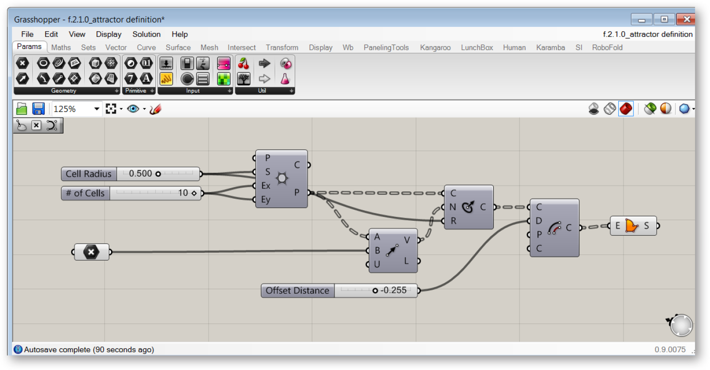

## Grasshopper - Обзор

#####Grasshopper - это редактор визуального программирования, разработанный Дэвидом Руттеном в Robert McNeel & Associates. Будучи плагином для Rhino3D, Grasshopper интегрирован с мощной и многофункциональной моделирующей средой, которая используется творческими профессионалами в широком диапазоне областей, включая архитектуру, проектирование, дизайн продукта и др. В тандеме, Grasshopper и Rhino предлагают нам возможность установить точный параметрический контроль за моделями, способность исследовать генеративный процесс проектирования, а также платформу для развития логики программирования высокого уровня - и все это при помощи интуитивно-понятного графического интерфейса.

Grasshopper берет свое начало в функционале кнопки "Record History" 
в Rhino3D версия 4. Данная встроенная функция давала пользователям
возможность сохранить процесс моделирования в истории по мере 
продвижения работы. Если вы применяли loft для 4-х кривых с включенной
записью истории, а затем меняли контрольные точки одной из кривых,
то поверхность геометрии обновлялась. В далеком 2008, Дэвид 
задался вопросом: "Что если бы у вас был более выраженный контроль
за этой историей?" и тогда был создан прототип Grasshopper,
Explicit History. Это дало доступ к дереву истории для подробного
редактирования и позволило пользователю развивать логические 
последовательности помимо существующих встроенных возможностей Rhino3D.    
Спустя шесть лет, Grasshopper стал мощным редактором визуального
программирования, возможности которого могут быть расширены наборами 
дополнений, разработанных отдельно. Более того, он в корне изменил
процесс работы специалистов во многих индустриях и взрастил активное
глобальное сообщество пользователей.

Это пособие фокусируется на Основных положениях, предлагая ключевые
знания, необходимые для погружения в регулярное использование 
Grasshopper и нескольких ответвлений, но также достаточных для того,
чтобы вы могли углублять свою практику. Перед погружением в описания, 
диаграммы и примеры, расположенные ниже, давайте обсудим, что есть
визуальное программирование, основы интерфейса и терминологии 
Grasshopper, а также о "live" характеристиках - обратной связи 
видовых окон и взаимодействии пользователя с интерфейсом.

Визуальное программирование это парадигма компьютерного программирования
внутри которой пользователь управляет логическими элементами графически, 
а не текстом. Некоторые из самых известных текстовых языков программирования,
таких как C#, Visual Basic, Processing - и ближайшее к Rhino - Python 
и Rhinoscript, требуют написание кода с использованием специального 
языкового синтаксиса. Визуальное программирование, напротив, позволяет
нам соединить функциональные блоки в последовательность действий, 
где единственное требование "синтаксиса" - чтобы входы блоков получали 
подходящие по типу данные, и в идеале, организованную в соответствии с 
требуемым результатом - см.разделы Соединение Потоков Данных и Проектирование
с использованием Деревьев Данных. Эта черта визуального программирования
позволяет избежать барьера, типично встречающегося при попытке выучить 
новый язык, даже разговорный, а также выдвигает на передний план 
интерфейс, который размещает Grasshopper в более знакомой обстановке 
для проектировщиков.

>Это фото показывает процесс черчения синусоидальной кривой в Python и в Grasshopper.

Чтобы начать работать в Grasshopper, необходимо скачать и установить 
программу с сайта Grasshopper3D.com. Когда программа установлена, вы 
можете открыть плагин, напечатав "Grasshopper" в командной строке Rhino.
Когда мы сделаем это в первый раз при запуске новой сессии Rhino, нам 
покажут загрузочные подсказки Grasshopper, сопровождаемые окном 
редактирования Grasshoppper. Теперь мы можем добавлять функциональные 
блоки, которые называются "компонентами" на "холст", соединять их 
"связями" и сохранять целое "определение" в формате .ghx.

>Определение Grasshopper, состоящее из компонентов, соединенных связями на холсте

Как только мы начали развивать определение Grasshopper и создали объекты,
называемые "слайдер", мы можем контролировать геометрию, можем легко 
постигать интуитивно связи, которые мы создали между входом этого объекта
и тем, что мы видим в видовом окне Rhino. Эта связь, по существу, "живая". 
Если мы изменим положение ползунка слайдера, мы увидим последствия этого
действия, так как вводные параметры в каком-то месте нашего определения 
изменились и поэтому программа должна пересчитать решение и отобразить 
обновление. К счастью для нас, в начале использования Grasshopper, 
предпросмотр геометрии, которую мы видим, это упрощенное представление 
решения и оно обновится автоматически. Важно сейчас принять к сведению 
эту связь, потому что когда ваши определения станут более сложными, 
правильное управление потоком данных, статусом инструмента "проверки"
и отображением в окне просмотра Rhino предотвратит многие нежелательные проблемы.

>Программа работает слева направо

####НЕОБХОДИМО ЗАПОМНИТЬ
* Grasshopper - это редактор графических алгоритмов, интегрированный с 
3D моделирующими инструментами Rhino.
* Алгоритмы - это пошаговые процедуры, спроектированные для выполнения
операций.
* Вы используете Grasshopper, чтобы спроектировать алгоритмы, которые
затем автоматизируют задачи в Rhino3D.
* Быстрый способ начать, если вы не знаете, как выполнять определенные
операции в Grasshopper, это попытаться вручную и постепенно создать 
алгоритм, используя команды Rhino.

Как только вы впервые начали исследовать Grasshopper или развивать 
ваши навыки, это означает, что вы присоединились к глобальному 
сообществу Grasshopper, состоящему из активных людей из различных 
областей, с различными уровнями опытности. Форум на сайте 
Grasshopper3D.com - это полезный ресурс для публикования вопросов,
чтобы поделиться находками и получить знания. Это сообщество, которым
мы дорожим, когда писали это пособие и наблюдали за развитием Grasshopper 
все эти годы. Добро пожаловать!
