### 1.1.2. ПОЛЬЗОВАТЕЛЬСКИЙ ИНТЕРФЕЙС GRASSHOPPER

#####Визуальный стиль Grasshopper "соединяй-и-работай" дает дизайнерам возможность сочетать творческое решение вопросов с инновационными системами правил посредством использования потокового графического интерфейса.

Давайте начнем знакомство с Grasshopper с пользовательского интерфейса ПИ. Grasshopper - это
приложение визуального программирования, где вы можете создавать программы, называемые
definition (определение) или documents (документы), путем расположения компонентов на главном окне
редактирования (canvas - холст). Выходы этих компонентов соединяются
с входами последующих компонентов - создавая график информации, который
можно прочитать слева направо. Давайте начнем с этих основ.

Предположим, вы уже установили плагин Grasshopper (см. F.0.0), наберите слово "Grasshopper" в командной строке Rhino, чтобы показать редактор Grasshopper. Интерфейс Grasshopper содержит некоторое число элементов, большинство которых будут хорошо знакомы пользователям Rhino. Давайте посмотрим на несколько функций интерфейса.

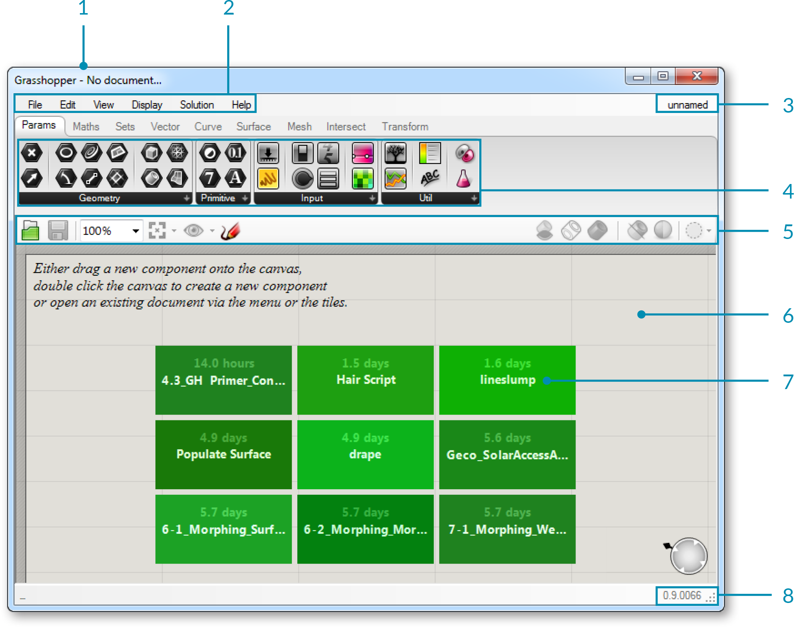
>1. Строка заголовка окна.
2. Строка главного меню.
3. Контроль диспетчера файлов.
4. Панели компонентов.
5. Панель инструментов холста.
6. Холст.
7. Эта область, отмеченная сеткой из прямоугольных ячеек, открывает интерфейс, с помощью которого можно открыть недавно вызванные файлы. Меню 3x3 показывает файлы, которые были недавно изменены (в хронологическом порядке). Красным цветом будет отмечен файл, который не удается найти (такое может случится если вы перемещали файл в новую папку или удалили его).
8. Строка состояния сообщает вам о том, какая версия Grasshopper установлена в текущий момент на вашем компьютере. При наличии более новой версии, выпадающее меню с инструкциями как скачать последнюю версию.

####1.1.2.1. СТРОКА ЗАГОЛОВКА ОКНА
Редактор строки заголовка окна ведет себя по-разному в отличие от 
большинства других диалоговых окон в Microsoft Windows. Если окно 
находится не в уменьшенном или увеличенном размере, двойной клик 
по строке заголовка свернет окно в уменьшенный размер на вашем экране.
Это хороший способ переключаться между плагином Grasshopper и Rhino, 
т.к. это окно редактор сворачивается без необходимости перемещать его 
к краю экрана или размещения позади других окон. Помните, что если вы 
закроете окно редактора, предпросмотр геометрии Grasshopper в видовом 
окне Rhino исчезнет, но сам файл не будет закрыт. В следующий раз когда 
вы запустите команду "Grasshopper" в диалоговом окне Rhino, окно вернется 
в том же виде с теми же загруженными файлами. Так происходит потому, 
что как только оно загружено по запросу команды, ваша сессия в 
Grasshopper остается активной до тех пор, пока Rhino не закрыт.

####1.1.2.2. СТРОКА ГЛАВНОГО МЕНЮ
Эта строка похожа на обычное меню Windows, за исключением контроля диспетчера 
файла справа (см.следующий раздел). Меню файла предоставляет стандартные функции 
(например, New File (новый документ), Open (открыть), Save (сохранить) и т.д.) в 
добавок к нескольким инструментам, которые позволяют вам экспортировать 
изображения вашего текущего документа Grasshopper (см. Export Quick Image - быстрый
экспорт изображения и Export Hi-Res Image - экспорт изображения высокого разрешения).
Вы можете контролировать различные аспекты пользовательского интерфейса, используя 
меню View (вид) и Display (дисплей/отображение). Меню Solution (решение) позволяет 
управлять различными параметрами того, как инструмент проверки вычисляет схемы решений.

Следует упомянуть, что многие настройки приложения можно контролировать через 
диалоговое окно Preferences (Настройки), располагающееся под меню File. Секция
Author (Автор) позволяет настраивать персональные метаданные, которые будут 
сохраняться с каждым документом Grasshopper, в то время как секция Display 
(дисплей/отображение) предоставляет точные контроль за видом и функцией 
интерфейса. Секция File (файл) позволяет уточнить такие моменты, как часто и 
где сохранять автоматически сохраняемые файлы (в случае если приложение было 
непреднамеренно закрыто или дало сбой). Ну и наконец, секция Solver (инструмент
проверки) позволяет управлять основными и сторонними плагинами, которые могут 
увеличить функциональность.

> Примечание: Будьте внимательны при использовании "горячих" клавиш, так как они осуществляются активным окном, а это может быть как Rhino так холст Grasshopper или любое другое окно внутри Rhino. Довольно легко использовать "горячие" клавиши, а потом осознать, что у вас выбрано не то окно и случайно вы вызвали не ту команду.

>Окно Preferences позволяет настроить большинство из настроек приложения Grasshopper.

####1.1.2.3. УПРАВЛЕНИЕ ДИСПЕТЧЕРОМ ФАЙЛОВ
Диспетчер файлов позволяет быстро переключаться между различными загруженными 
файлами, выбирая их через выпадающий список. Получив доступ к вашим открытым 
файлам через выпадающий список диспетчера файлов, вы сможете быстро копировать
и вставлять элементы из открытых определений. Просто кликните на имени 
активного файла в окне управления диспетчера, и каскадный список отобразит все
открытые файлы для быстрого доступа к ним (рядом будет миниатюрное изображение
каждого открытого определения). Можно также нажать комбинацию клавиш Alt+Tab, 
чтобы быстро переключиться между любыми открытыми документами Grasshopper.

Конечно, вы можете пойти через стандартный диалог Open File для загрузки 
любого документа Grasshopper, хотя вы можете также перетащить любой файл
Grasshopper на холсте, чтобы загрузить определенное определение.

> Grasshopper - это плагин, который работает "поверх" Rhino и поэтому имеет свои типы файлов. 
Тип файла по умолчанию - файл с бинарными данными, сохраняется с расширением .gh. Другой тип файлов известен как Grasshopper XML файл, имеет расширение .ghx. Тип файлов XML (расширяемый язык разметки) использует тэги для определения объектов и характеристики объектов (почти как .HTML документ), но использует настраиваемые тэги для определения объектов и данных внутри каждого объекта. Из-за того, что XML файлы отформатированы как текстовые документы, вы можете открыть любой файл Grasshopper XML в текстовом редакторе, например NotePad, чтобы посмотреть на код, который стоит за всем этим.

Grasshopper может открыть файл несколькими способами, поэтому вам нужно будет 
указать, какой способ вы хотите использовать.

**Open File (Открыть Файл):** Как и предполагает имя, этот способ открытия файла 
просто откроет любое определение, которое вы перетащите на холст.

**Insert File (Вставьте Файл):** Вы можете воспользоваться этим способом, чтобы 
вставить существующий файл в текущий документ как свободный компонент.

**Group File (Сгруппировать Файл):** Этот метод вставит файл в существующий 
документ, но сгруппирует все объекты вместе.

**Cluster File (Кластеризовать Файл):** Похоже на функцию Сгруппировать,
этот метод вставит файл в существующий документ, но создаст объединенный объект 
(кластер) для целой группы объектов.

**Examine File (Исследовать Файл):** Позволяет вам открыть файл в защищенном
режиме, то есть вы сможете рассмотреть определенный файл, но вы не сможете 
внести изменения в определение.

Grasshopper также обладает функцией Автосохранения, которая периодически
будет срабатывать, основываясь на особых действиях пользователя. Список 
параметров Автосохранения находится под меню File на Строке основного меню. 
При закрытии активной сессии Rhino, во всплывающем окне появится вопрос - 
хотите вы или нет сохранить какие-либо файлы Grasshopper, которые были 
открыты на момент закрытия Rhino.

>Автосохранение работает при условии, что файл уже однажды был сохранен, по крайней мере, один раз.

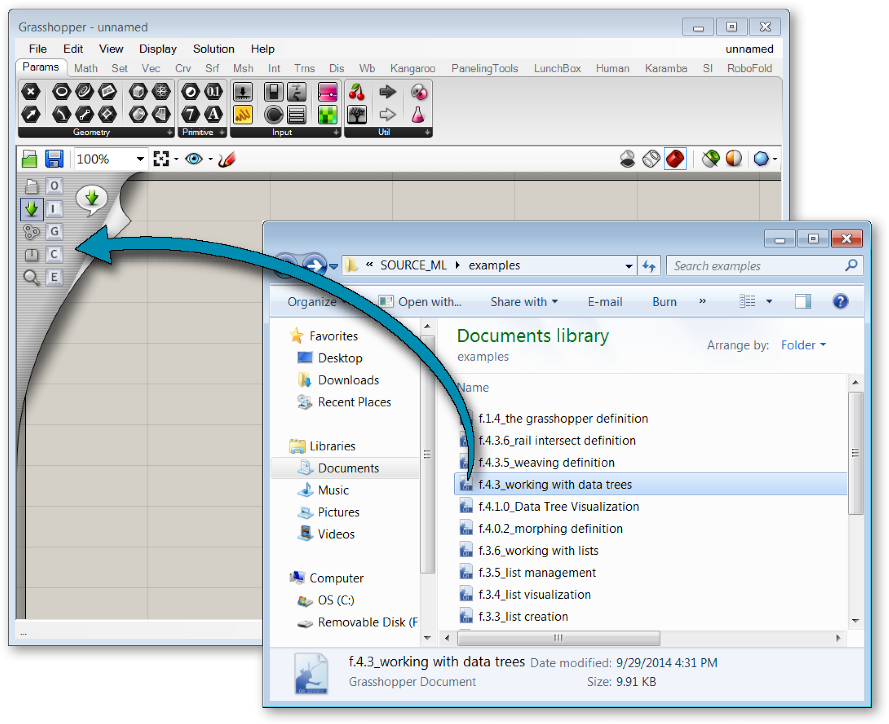
>Файлы, которые перетащили на холст.

####1.1.2.4. ПАНЕЛИ КОМПОНЕНТОВ
В этой области размещены компоненты, которые разделены на категории и свитки. 
Категории отображаются как вкладки, свитки отображаются как выпадающие панели. 
Все компоненты принадлежат к определенной категории. Эти категории были разбиты
на классы, чтобы помочь вам найти определенный компонент (например, "Params" 
для всех примитивных типов данных или "Curves" для всех инструментов, связанных
с кривыми). Два способа добавления компонента на холст: кликнуть на объект в 
выпадающем меню или перетащить компонент прямо из меню на холст.

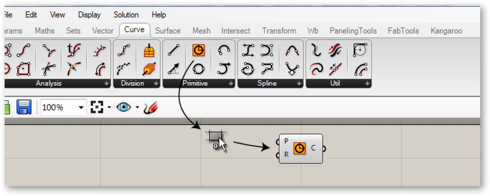
>Компонент, который перетащили с панели для добавления компонента на холст.

Так как в каждом свитке может быть гораздо больше компонентов, чем поместиться 
на палитру, на каждой панели отображается ограниченное число иконок. Высоту 
панели компонентов и ширину окна Grasshopper можно настроить так, чтобы отображалось
больше или меньше компонентов в подкатегории. Чтобы посмотреть меню всех компонентов
в данном свитке, просто кликните на черной строке внизу каждой панели свитка. Тогда 
откроется выпадающее меню, которое покажет все компоненты в данной подкатегории.

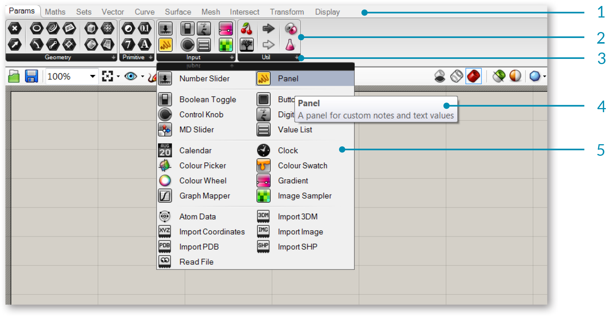
>1. Вкладка категории
2. Панель свитка.
3. Кликните на черной строке, чтобы открыть панель меню свитка.
4. Наведите мышку на компонент для получения краткого описания.
5. Выпадающее меню.

####1.1.2.5. ХОЛСТ
Холст - это основное рабочее пространство для создания определения Grasshopper.
Здесь вы можете взаимодействовать с элементами вашего визуального программирования.
Вы можете начать работать на холсте, размещая компоненты и соединяя их связями.

####1.1.2.6. ГРУППИРОВАНИЕ
Группирование компонентов вместе на холсте может быть особенно полезно для
разборчивости и доступности для восприятия. Группирование позволяет вам быстро
выбирать и передвигать множество компонентов по холсту. Вы можете создать группу,
набрав Ctrl+G при этом желаемый компонент должен быть выбран. Можно выбрать 
альтернативный метод группирования -  нажав кнопку "Group Selection" (Выбор Группы)
под Меню Edit на Строке главного меню. Настройте параметры цвета группы, 
прозрачности, имени и типа контура кликнув правой кнопкой мыши на любом объекте группы.

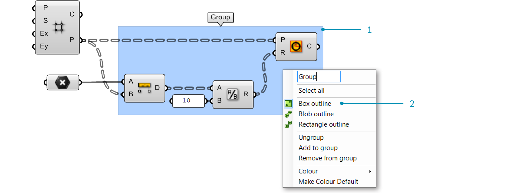
>1. Группа компонентов, очерченная прямоугольником.
2. Щелкните правой кнопкой мыши в любом месте группы для редактирования имени и вида группы.

>Вы также можете обозначить группу, используя алгоритм метабол с использованием силуэта расплывчатого пятна.

>Две группы расположены одна внутри другой. Цвет (светло-голубой) был изменен у внешней группы для лучшей визуальной идентификации одной группы от другой. Группы начерчены "позади" компонентов и включают их, в таких случаях как этот, присутствует глубина цвета в соответствии и порядком двух групп. Чтобы изменить это, нажмите Edit>Arrange в строке главного меню.

####1.1.1.7. ВИДЖЕТЫ
В Grasshopper доступны несколько виджетов, которые могут помочь вам выполнять
полезные действия. Вы можете включить/выключить любые из этих виджетов под 
меню Display (дисплей/отображение) на Строке главного меню. Ниже мы познакомимся
с несколькими самыми часто используемыми виджетами.

**The Align Widget**
Один из полезных виджетов для пользовательского интерфейса, который помогает 
поддерживать порядок на холсте - это Align виджет. Вы получите доступ к виджет
у Align, если выберите несколько компонентов одновременно и кликните на одной
из опций, обнаруженных на пунктирном силуэте, которые окружают выбранные вами
компоненты. Вы можете выравнивать по левой стороне, вертикально по центру, 
по правой стороне, по верху, горизонтально по центру, по низу или расположить
компоненты равномерно через этот интерфейс. В самом начале вы можете столкнуться
с тем, что инструменты мешают при работе (есть вероятность совершить ошибку 
при накладывании нескольких компонентов один на другой). Тем не менее, после
небольшой практики эти инструменты могут стать бесценными, когда вы начнете 
структурировать графики, чтобы они были удобочитаемыми и понятными.

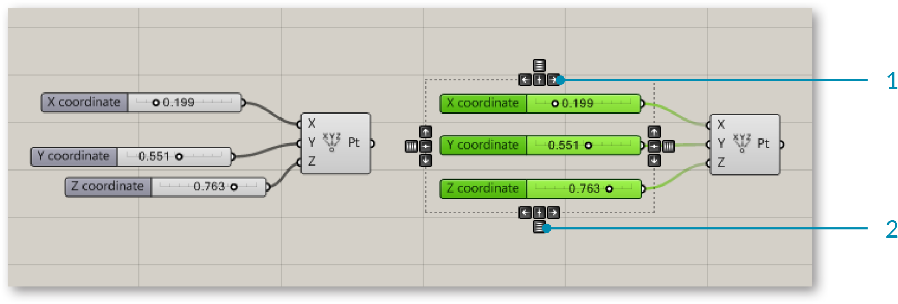
>1. Выровнять по правой стороне.
2. Распределить по вертикали.

**The Profiler Widget**
Этот виджет выдает список наихудшего времени выполнения для параметров
и компонентов, позволяя отслеживать узкие места в сети и сравнивать 
различные компоненты в плане затрат на выполнение. Помните, что этот
виджет отключен по умолчанию.

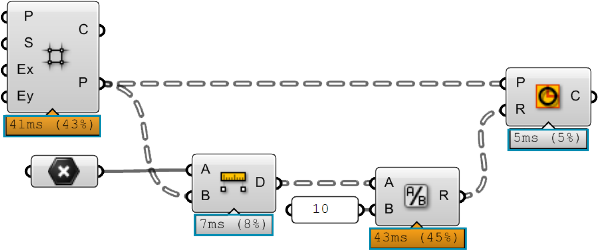
>Виджет Profiler предоставляет визуальную обратную связь по тому, какие компоненты в вашем определении могут занять длительное время на выполнение операции.

**The Markov Widget**
Этот виджет использует цепь Маркова, чтобы предугадать какой компонент вы захотите
использовать следующим, основываясь на вашем предыдущем поведении. Цепь Маркова - 
это процесс, который состоит из четного числа состояний (или уровней) и некоторых
известных возможностей. Этому виджету потребуется некоторое время для настройки под
определенного пользователя, но спустя некоторое время вы должны начать замечать, 
что этот виджет начинает предлагать компоненты, которые вы хотите использовать 
следующими. Виджет Markov может предлагать до 5 возможных компонентов в зависимости
от недавней активности. Кликните правой кнопкой мыши по виджету (по умолчанию 
располагается в левом нижнем углу холста), чтобы разметить его в одном из других
углов холста или полностью спрятать.

####1.1.2.8. ИСПОЛЬЗОВАНИЕ ФУНКЦИИ ПОИСКА
Несмотря на то, что было много размышлений насчет того, как лучше расположить
каждый компонент на панели, чтобы это было интуитивно легко для новых пользователей, 
им все равно иногда трудно найти определенный компонент, который может быть 
расположен в глубинах панелей категорий. К счастью, вы также можете находить
компоненты по имени, дважды кликнув в любом пустом месте на холсте. Сделав это,
вы вызовете окно поиска. Далее, просто наберите название компонента, появится 
список параметров или компонентов, подходящих под ваш поиск.

>Кликните дважды в любом месте на холсте, чтобы вызвать поиск по ключевым словам для поиска определенного компонента.

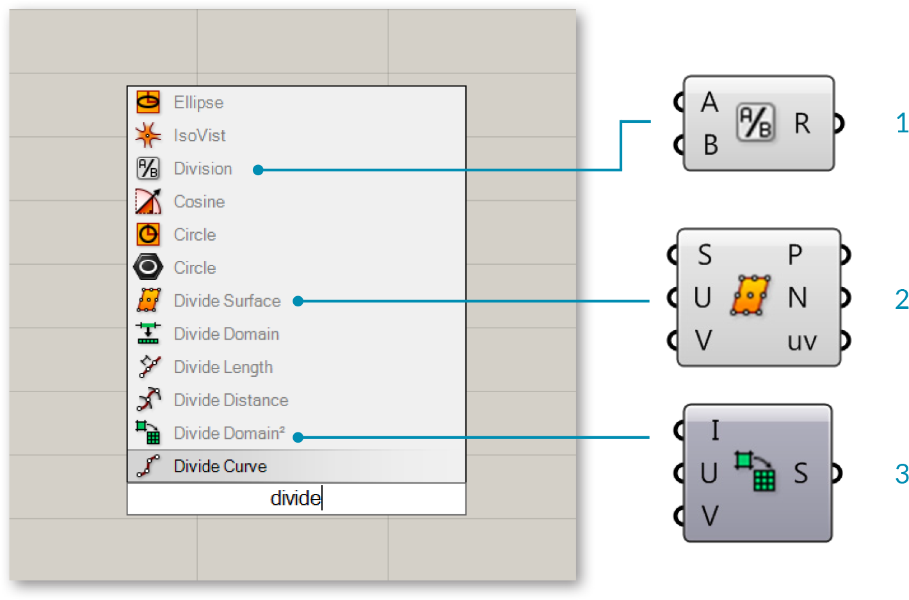
>Набрав "divide", вы получите список различных компонентов.
1. Компонент Division Operator.
2. Компонент Divide Surface.
3. Компонент Divide Domain2.

####1.1.2.9. ФУНКЦИЯ ПОИСКА
Существуют, в буквальном смысле, сотни (если не тысячи) компонентов Grasshopper, 
которые вы можете использовать, и вас, как новичка, может испугать то, а где 
искать определенный компонент на Панели Компонентов. Быстрое решение - это 
дважды кликнуть в любом месте холста, чтобы запустить поиск необходимого 
компонента. Тем не менее, что если нам требуется найти определенный компонент,
уже расположенный на нашем холсте? Беспокоиться не о чем. Кликнув правой клавишей
мыши на холсте или нажав F3, вы вызовете функцию поиска. Начните печатать название
компонента, который вы ищете.

Функция поиска использует некоторые сложно организованные алгоритмы, которые 
осуществляют поиск не только по отдельным наименованиям компонентов внутри 
определения (наименование компонента - это название компонента, которое 
находится под Панелью Компонентов и которое мы, как пользователи, не может
изменить), но и также по любым уникальным признакам, которые мы присвоили 
определенным компонентам (известным как псевдоним или прозвище). Функция 
поиска также может осуществлять поиск по типу компонента на холсте или поиск
по текстовой панели, наброскам и групповому контенту. Как только функция поиска
нашла совпадение, она автоматически выделит серым цветом остальное определение
и проведет пунктирную линию вокруг выделенного компонента. Если будут обнаружены
несколько совпадений, список компонентов, отвечающих вашему поиску, будут 
отображены в диалоговом окне и будут находиться поверх наименования из списка,
которое будет подсвечено зеленым цветом.

>Кликнув правой клавишей мыши на холсте или нажав F3, вы вызовете функцию поиска. Начните печатать название компонента, который вы ищете.

>Функция поиска может быть очень полезной для нахождения определенного компонента на холсте. Кликните правой клавишей мыши по холсту, чтобы запустить окно поиска.

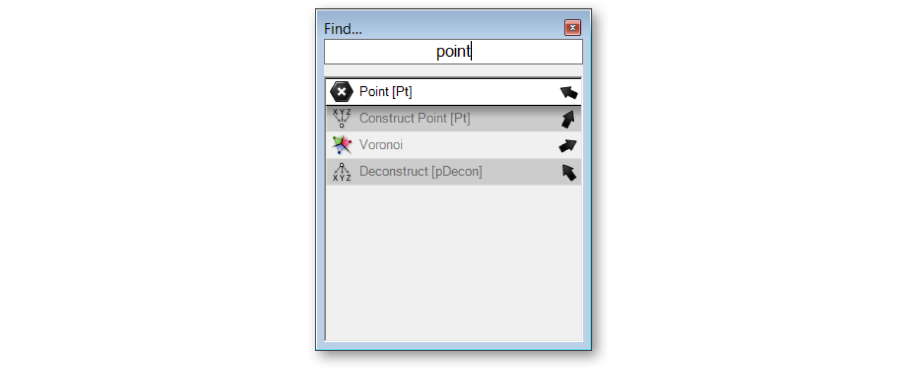
>Маленькая стрелка также будет отображаться рядом с каждым элементом в списке, 
указывая на соответствующий компонент на холсте. Попробуйте покрутить поисковое
диалоговое окно по холсту и посмотрите, как стрелки вращаются, чтобы отследить 
их компоненты. Кликнув по результатам поиска, компонент разместится (на холсте)
рядом с диалоговым окном Поиска.

####1.1.2.10. ИСПОЛЬЗОВАНИЕ РАДИАЛЬНОГО МЕНЮ
По мере того, как вы будете становиться большими профессионалами в использовании
интерфейса Grasshopper, вы будете находить способы ускорить вашу работу. 
Один из таких способов - это использование быстрых клавиш. Также существует и 
другой способ быстрого доступа к некоторым полезным инструментам - радиальное
меню ПИ. Вы можете вызвать радиальное меню, нажав клавишу пробела (в то время
как ваша мышка находится над холстом или компонентом) или кликнув средней 
клавишей мыши. Радиальное меню включает различные инструменты, в зависимости от
того, вызвали ли вы меню кликнув прямо над компонентом или просто в любом месте
холста. На изображении ниже, вы можете увидеть, что радиальное меню имеет больше
доступных функций при клике над выбранным компонентом в отличие от клика просто
в любом месте холста. Использование этого меню может значительно ускорить вашу
скорость работы с документами Grasshopper.

>ПИ радиального меню позволит быстро получить доступ к часто используемым пунктам меню.

####1.1.2.11. ПАНЕЛЬ ИНСТРУМЕНТОВ ХОЛСТА
Панель инструментов холста предоставляет быстрый доступ к часто используемым
компонентам Grasshopper. Все инструменты доступны через меню, вы можете спрятать
панель инструментов, если захотите. Панель инструментов можно редактировать во 
вкладке View (вид) на Строке главного меню.

>1. **Open File (Открыть Файл):**  Ссылка для открытия файла Grasshopper.
2.  **Save File (Сохранить файл):** Ссылка для сохранения текущего файла Grasshopper.
3.  **Zoom Defaults (Масштаб по умолчанию)**: Настройки масштаба по умолчанию позволяют вам увеличивать или уменьшать холст по предустановленным интервалам.
4. **Zoom Extents (Масштаб):** Масштабируйте по размеру вашего определения. Кликните по стрелке рядом с иконкой Zoom Extents, чтобы выбрать один из элементов подменю для масштабирования определенной области вашего определения.
5. **Named Views (Именнованный просмотр):** Эта функция раскрывает меню, позволяя вам разместить или переименовать любую область просмотра в вашем определении.
6. **The Sketch Tool (Инструмент для скетчей):** Этот инструмент работает также как инструмент "карандаш" в
программе Adobe Photoshop, но имеет несколько дополнительных функций.

>1. **Настройки просмотра:** Если компонент Grasshopper генерирует какую-либо геометрию, тогда предпросмотр этой геометрии будет происходить в видовом окне по умолчанию. Вы можете отключить предпросмотр для каждого отдельного объекта правым кликом мыши по каждому компоненту и отключить функцию предпросмотра, либо вы можете глобально изменить способы предпросмотра, используя одну из трех кнопок.
2. Режим просмотра структуры / каркаса.
3. Отключить предпросмотр.
4. Просмотр с тенью (по умолчанию).
5. **Предпросмотр выбранного объекта:** При нажатии этой кнопки, Grasshopper будет отображать геометрию, которая является частью выбранных компонентов, даже если у тех компонентов выключен режим предпросмотра.
6. **Настройки просмотра документа:** В Grasshopper по умолчанию настроена цветовая схема для выбранных (полупрозрачный зеленый) и невыбранных (полупрозрачный красный) геометрий. Эти цвета можно переназначить с использованием диалогового окна Настройки просмотра документа.
7. **Предпросмотр качества Mesh:**  В целях оптимизации эти настройки позволят вам контролировать качество отображения mesh/поверхности той геометрии, которая была отрендерена в Rhino. Высокие настройки качества станут причиной долгих просчетов, в то время как низкие настройки будут отображать не аккуратную геометрию при просмотре. Следует заметить, что геометрия все равно будет сохранять высокое разрешение при запекании файла в Rhino. Эти настройки, в основном, влияют на выполнение отображения и качество.

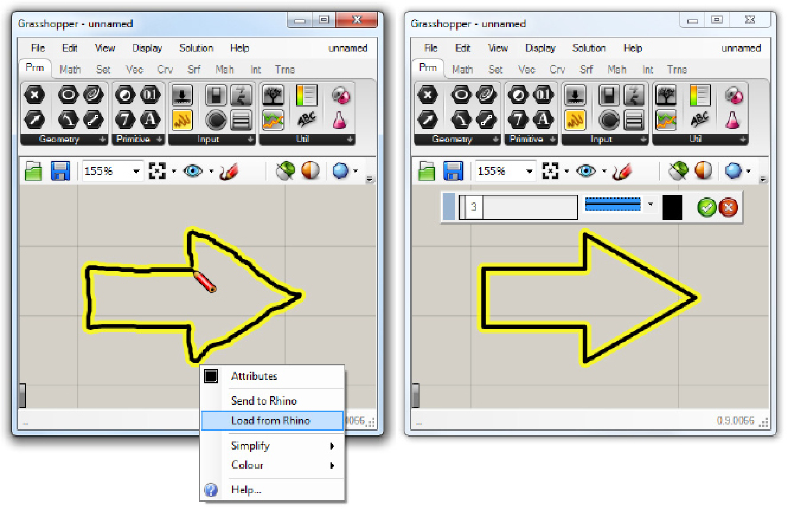
>Скетч инструмент позволяет поменять толщину линии, тип линии и цвет. Кликнув правой клавишей мыши по выбранному скетч-объекту, вы сможете выбрать упростить линию, чтобы создать эффект сглаживания. Кликните правой клавишей мыши по скетч-объекту и выберите "Load from Rhino". При появлении подсказки выберите любую 2Д форму в среде Rhino. Как только вы выбрали исходную форму, нажмите Enter, и предыдущий скетч будет отредактирован по вашей исходной форме в Rhino.

>Примечание: Ваш скетч-объект может сместиться с первоначального положения, когда вы загрузите форму из Rhino. Grasshopper располагает ваш скетч-объект относительно исходной точки холста (верхний левый угол) и мировых координат в Rhino.

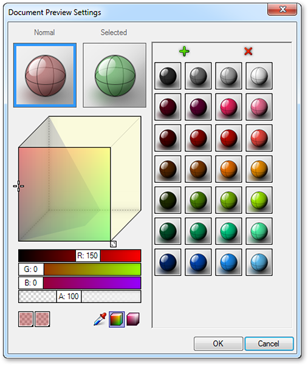
>В Grasshopper, по умолчанию, настроена цветовая схема для выбранных (полупрозрачный зеленый) и невыбранных (полупрозрачный красный) геометрий. Эти цвета можно переназначить с использованием диалогового окна Настройки просмотра документа.

