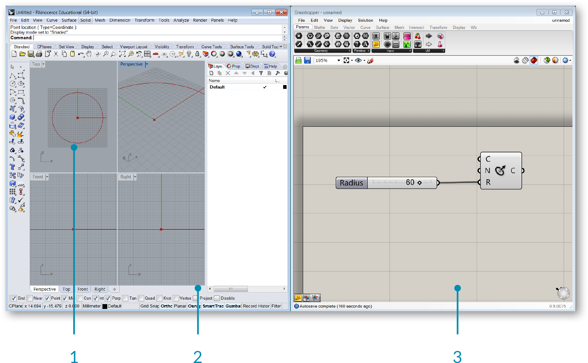
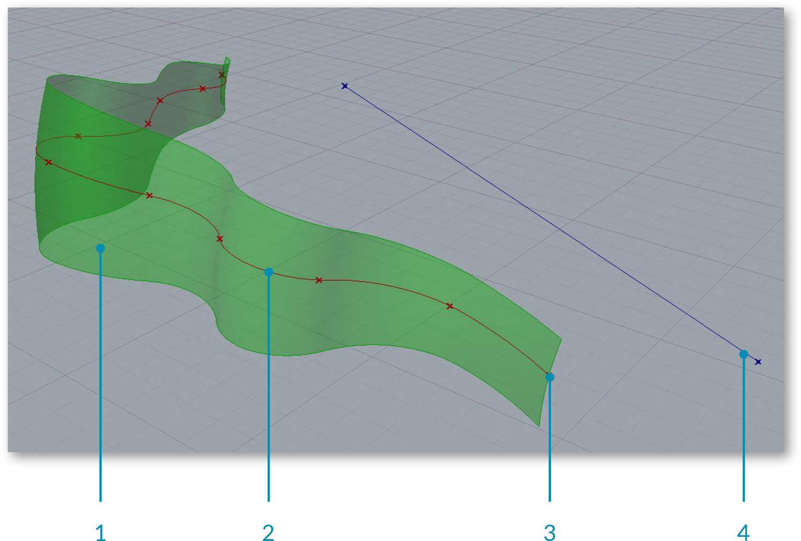
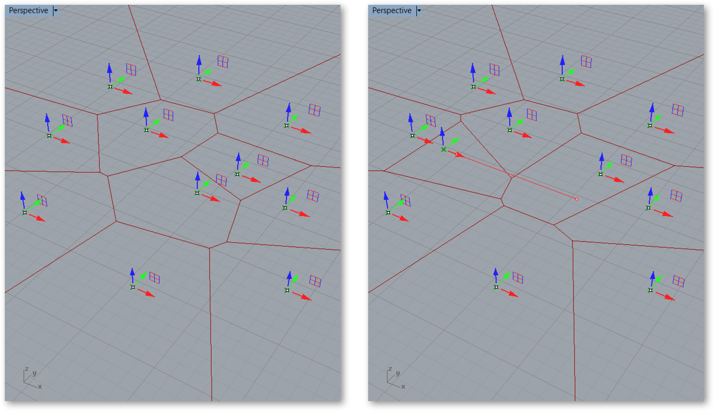
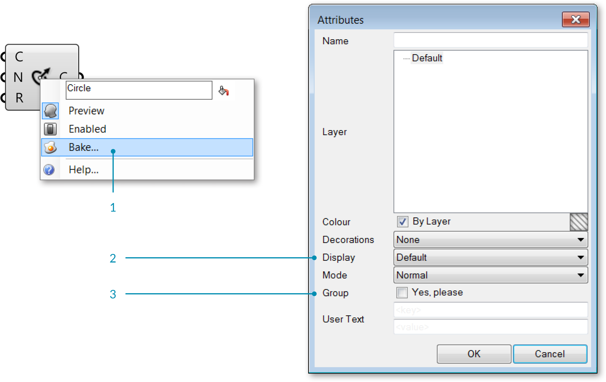
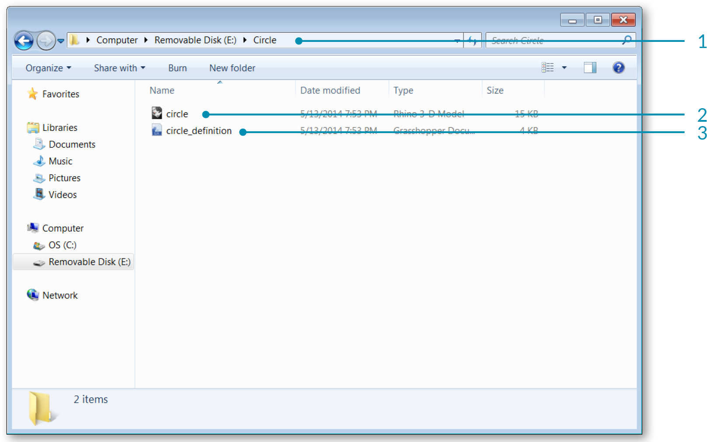
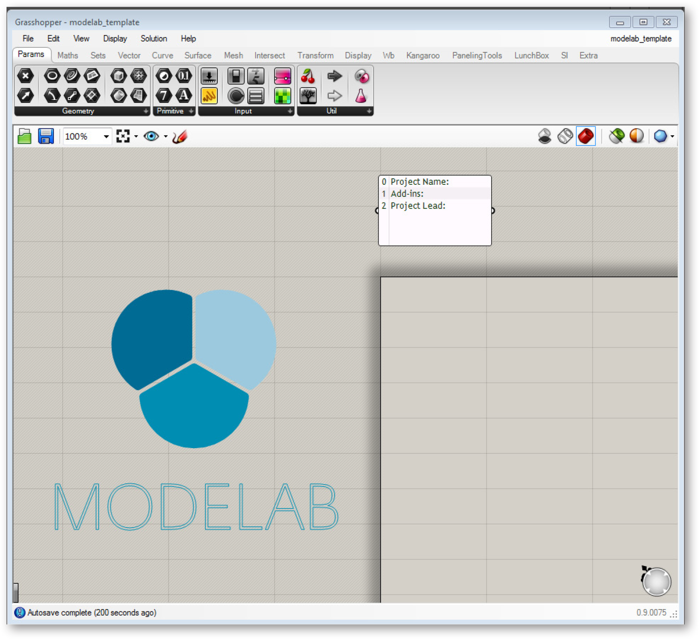
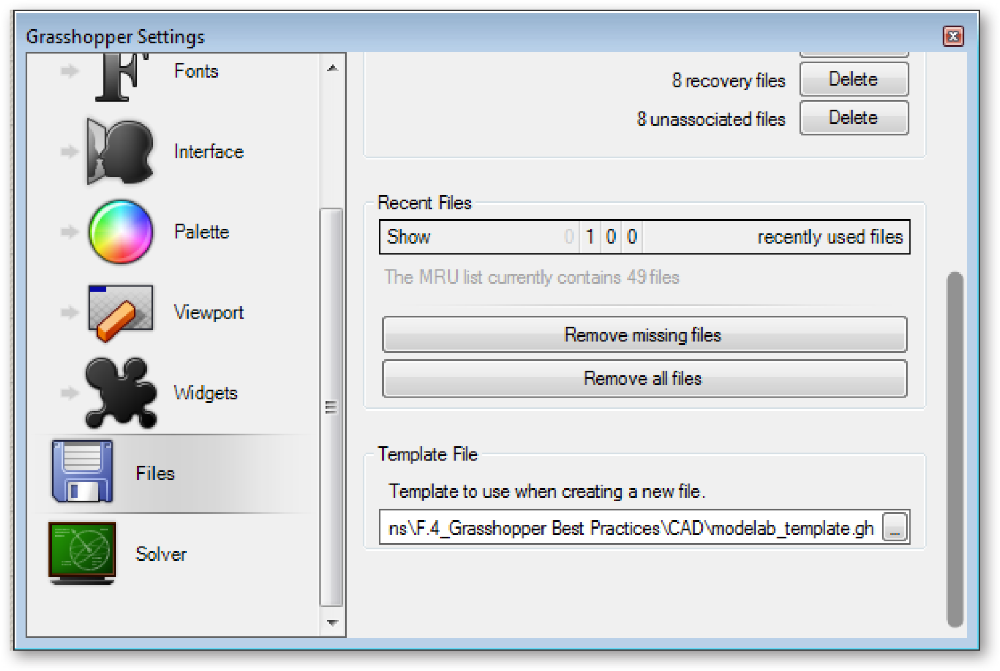

###1.1.3. ВЗАИМОДЕЙСТВИЕ С RHINO

#####В отличие от документа Rhino, определение Grasshopper не содержит реального объекта или геометрии. Вместо этого, определение Grasshopper представляет собой набор правил и инструкций о том, как Rhino может автоматизировать задачи.

>1. Предпросмотр геометрии Grasshopper.
2. Видовые окна Rhino.
3. Окно Grasshopper.

####1.1.3.1. ОБРАТНАЯ СВЯЗЬ С ВИДОВЫМ ОКНОМ
Вся геометрия, которая генерируется при использовании различных компонентов 
Grasshopper, будет отображаться (по умолчанию) в видовом окне Rhino. Этот 
предпросмотр является, всего лишь, Open GL апроксимацией действительной геометрии
и, поэтому, вы не сможете выбрать геометрию в видовом окне Rhino (сначала вам 
нужно запечь ее). Вы можете отключить / включить предпросмотр геометрии правым
кликом мыши по компоненту и выбрав Preview toggle. Геометрия в видовом окне 
кодируется цветом, чтобы предоставить визуальный отклик. Изображение ниже 
представляет цветовую схему по умолчанию.

>Примечание: Это цветовая схема по умолчанию, которую можно изменять, используя настройки просмотра документа на панели инструментов холста.

>1. Зеленый цвет в видовом окне относится к компоненту, который выбран в текущий момент.
2. Красный цвет в видовом окне относится к компоненту, который не выбран в текущий момент.
3. Геометрия точек отображается в виде крестов, а не прямоугольников, для отличия ее от других точечных объектов Rhino.
4. Голубой цвет означает, что в данный момент вы выбираете объект в видовом окне Rhino.

####1.1.3.2. СВЯЗИ
Grasshopper - это динамическая среда. Изменения, которые происходят в реальном 
времени и их предпросмотр, обновляются в видовом окне Rhino.

####1.1.3.3. ВИДЖЕТ GUMBALL
При сохранении геометрии как внутренней в параметре Grasshopper, Gumball 
позволяет вам взаимодействовать с геометрией в видовом окне Rhino. При 
манипулировании Gumball, обновление будет происходить сразу же. Напротив, геометрия, 
исходящая из Rhino, будет и дальше существовать в документе Rhino и обновления 
из Grasshopper произойдут только после того, как произойдут какие-либо изменения.

####1.1.3.4. "ЗАПЕКАНИЕ" ГЕОМЕТРИИ
Для того, чтобы работать с геометрией в Rhino (выбрать, редактировать, изменять и т.д.), 
которая была создана в Grasshopper, вы должны "запечь" ее. "Запекание" создает новую
геометрию в Rhino, берущей за основу текущее состояние из Grasshopper. Больше геометрия 
не будет реагировать на изменения в вашем определении.

>1. Чтобы запечь геометрию, кликните правой клавишей мыши на компоненте и выберите Bake.
2. Появится диалоговое окно, в котором вы сможете выбрать, в какой слой Rhino вы хотите "запечь" геометрию.
3. Группирование "запеченой" геометрии является удобным способом управления созданной в Rhino геометрией, особенно, если вы создаете много объектов в Grasshopper.

####1.1.3.5. ЕДИНИЦЫ ИЗМЕРЕНИЯ И ТОЧНОСТЬ
Grasshopper наследует единицы измерения и точность от Rhino. Чтобы изменить 
единицы измерения, впишите в командную строку Rhino Document Properties, 
чтобы зайти в меню  Document Properties. Выберите Units, чтобы изменить 
единицы измерения и точность.

>Измените единицы измерения и точность в Rhino в меню Document Properties.

####1.1.3.6. ПАНЕЛЬ ДИСТАНЦИОННОГО УПРАВЛЕНИЯ
Как только вы научитесь использовать ее, вы убедитесь, что Grasshopper - это 
невероятно мощный и гибкий инструмент, который позволяет исследовать итерации 
проектирования, используя графический интерфейс. Тем не менее, если вы работаете
с одним экраном, вы уже могли заметить, что Grasshopper занимает много пространства
экрана. И другого, более удобного, решения этой проблемы, только как постоянное
приближение и отдаление окон, не существует. Так было, пока не выпустили панель дистанционного управления!

Панель дистанционного управления (RCP) предоставляет минимальный интерфейс для 
осуществления контроля над вашим определением и не занимает львиную долю вашего
экрана. RCP можно создать кликнув по кнопке под меню View (вид) на панели 
главного меню. По умолчанию, RCP отключен, т.е. не содержит никакой информации
о вашем текущем файле Grasshopper. Чтобы наполнить RCP такими элементами UI как
слайдеры, переключатели и кнопки, просто кликните по элементу и кликните 
Publish To Remote Panel (вывести на RCP). Так вы создадите новую группу и 
синхронизируйте элементы UI с RCP. Изменяя значение элемента в RCP, вы также обновите
значение в графике, а также изменит любую геометрию в видовом окне, которая может
зависеть от этого параметра. Вы можете опубликовать многочисленные элементы и 
создать полный интерфейс, который можно использовать для контроля вашего файла, 
при этом не создавать бардак из визуальных графиков выделяющихся поверх видовых окон Rhino.

>Примечание: RCP перенимает название элементов UI и использует их как ярлыки. Принято обновлять названия слайдеров и переключателей на четкие и понятные названия. Это обновление также переместится прямо в RCP и сделает его использование проще.

> Чтобы достать элемент UI (например, слайдер, переключатель, кнопки и т.д.) и отобразить его в RCP сначала необходимо опубликовать его.

UI RCP также можно настроить для себя и это позволит вам контролировать появление
объектов на интерфейсе, названия и цвета различных групп. Чтобы изменить слой RCP,
вам сначала надо переключиться из режима Working Mode (по умолчанию) в Edit Mode.
Вы можете перейти в Edit Mode, кликнув по зеленому карандашу в правом верхнем углу
RCP. Находясь в Edit Mode, вы можете создавать новые группы UI, перегруппировать
элементы внутри группы, добавлять ярдыки, менять цвета и др. Чтобы удалить элемент
UI, просто перетащите элемент за границы RCP. Вы не можете изменять индивидуальные
значения параметров, если вы находитесь в Edit Mode. Вместо этого, вам необходимо 
кликнуть на иконку зеленого карандаша, чтобы переключиться обратно в стандартный режим (Working).

>_У RCP имеются два режима работы: Edit Mode (режим редактирования) (слева) - позволяет реорганизовать внешний вид RCP, Working Mode (рабочий режим) позволяет менять реальные значения элементов UI._

>В Edit Mode у RCP оранжевый фон.

####1.1.3.7. УПРАВЛЕНИЕ ФАЙЛАМИ
Если ваш файл Grasshopper берет начальную геометрию из Rhino, вам следует 
открыть тот же самый файл. Храните файлы Rhino и Grasshopper организованно в
одной папке с одинаковыми именами файлов.

>1. Папка проекта.
2. Файл Rhino.
3. Файл Grasshopper.

####1.1.3.8. ШАБЛОНЫ
Создавая и устанавливая файл шаблон в настройках, Grasshopper создает
удобный способ создания каждого нового определения Grasshopper. Шаблон
может включать компоненты Grasshopper также как панели и скетч-объекты 
для обозначения.

>Создайте шаблон файла и сохраните его

>1. В File/Preferences, загрузите файл, который вы создали в шаблонах. Ваш шаблон будет теперь использоваться каждый раз при создании нового файла.

