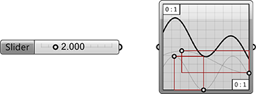

### 1.2.1. ТИПЫ ОБЪЕКТОВ GRASSHOPPER

#####Grasshopper состоит из двух основных типов пользовательских объектов: параметров и компонентов. Параметры хранят данные, а компоненты выполняют действия, которые превращаются в данные. Самый основной способ понять Grasshopper - это помнить о том, что мы будем использовать данные для определения вводных параметров действий (что в итоге превратится в новые данные, которые мы сможем продолжить использовать).

####1.2.1.1. ПАРАМЕТРЫ
Параметры хранят данные - числа, цвета, геометрию и т.д - которые мы передаем посредством схемы в нашем определении. Параметры - это такие контейнеры, которые обычно выглядят как небольшие прямоугольники с одним входом и одним выходом. Мы также понимаем, что это параметры, исходя из формы их иконки. У всех параметров вокруг их иконки есть шестиугольная рамка.

Геометрические параметры могут ссылаться на геометрию из Rhino или наследовать геометрию от других компонентов. Точка и кривая - это геометрические параметры.

Параметры ввода - это динамические объекты интерфейса, которые позволяют вам взаимодействовать с вашим определением. Number slider (числовой слайдер) и graph mapper оба являются параметрами ввода.

####1.2.1.2. КОМПОНЕНТЫ
Компоненты выполняют действия, основываясь на вводных параметрах, которые они получили. Имеется много типов компонентов для различных задач.

>1. Компонент multiplication- это оператор, который просчитывает продукт двух чисел.
2. Компонент Divide работает с геометрией, разделяя кривую на равные сегменты.
3. Компонент Circle CNR создает геометрию круга из вводных данных: точка начала координат, вектор нормали и радиус.
4. Компонент Loft создает поверхность посредством крупномасштабных восходящих кривых.

####1.2.1.3. ЦВЕТА ОБЪЕКТОВ
Мы можем почерпнуть информацию о состоянии каждого объекта, основываясь на их цветах. Давайте посмотрим на цветовую кодовую систему Grasshopper по умолчанию.

Параметр, который не содержит ни предупреждений ни ошибок, светло-серого цвета.
Этот цвет объекта показывает, что этот параметр работает должным образом.

A parameter which contains warnings is displayed as an orange box. Any object which fails to collect data is considered suspect in a Grasshopper definition since it is not contributing to the solution.. Therefore, all parameters (when freshly added) are orange, to indicate they do not contain any data and have thus no functional effect on the outcome of the solution. By default, parameters and components that are orange also have a small balloon at the upper right hand corner of the object. If you hover your mouse over this balloon, it will reveal information about why the component is giving you a warning. Once a parameter inherits or defines data, it will become grey and the baloon will disappear.

A component is always a more involved object, since we have to understand and then coordinate what its inputs and outputs are. Like parameters, a component with warnings is displayed as orange. Remember, warnings aren’t necessarily bad, it usually just means that Grasshopper is alerting you to a potential problem in your definition.

A component which contains neither warnings nor errors is shown in light gray.

A component whose preview has been disabled is shown in a slightly darker
gray. There are two ways to disable a component’s preview. First, simply right-click on the component and toggle the preview button. To disable the preview for multiple components at the same time, first select the desired components and then toggle the disable preview icon (blindfolded man) by right clicking anywhere on the canvas.

A component that has been disabled is shown in a dull gray. To disable a
component you may right-click on the component and toggle the disable button, or you may select the desired components, right click anywhere on the canvas and select Disable. Disabled components stop sending data to downstream components.

A component which has been selected will be shown in a light green color. If the selected component has generated some geometry within the Rhino scene, this will also turn green to give you some visual feedback.

A component which contains at least 1 error is displayed in red. The error can come either from the component itself or from one of its inputs or outputs.

>1. A parameter with no warnings or erros
2. A parameter with warnings
3. A component with warnings
4. A component with no warnings or errors
5. A component with preview disabled
6. A component that has been disabled
7. A selected component
8. A component with an error
