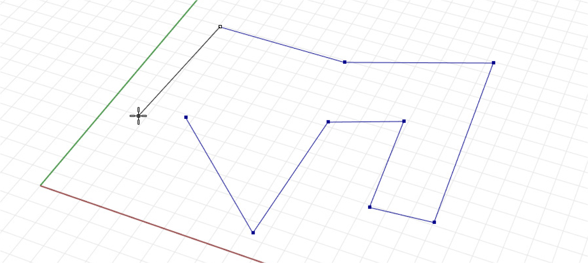
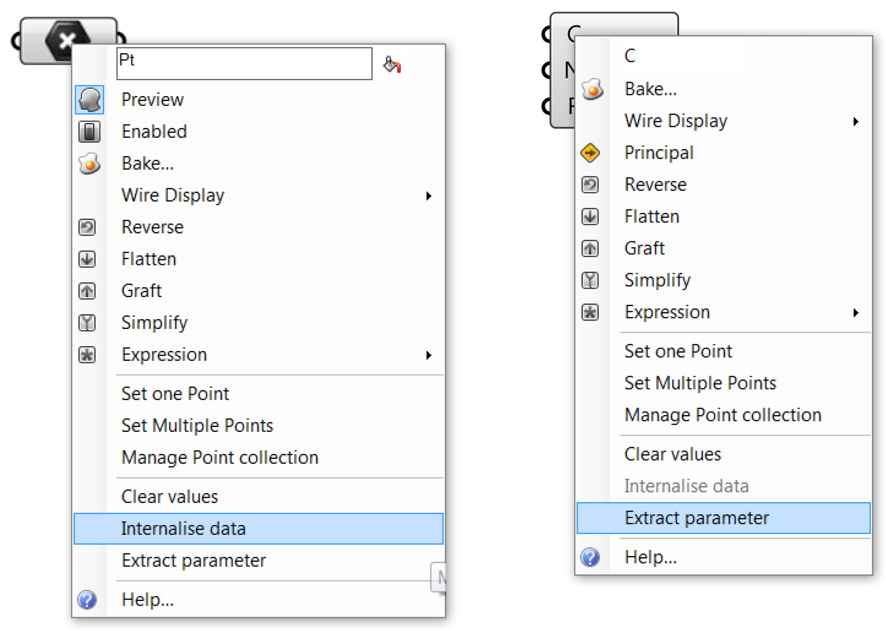
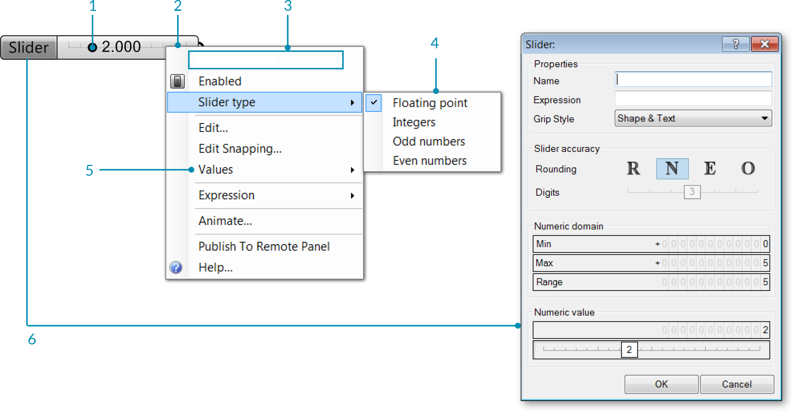
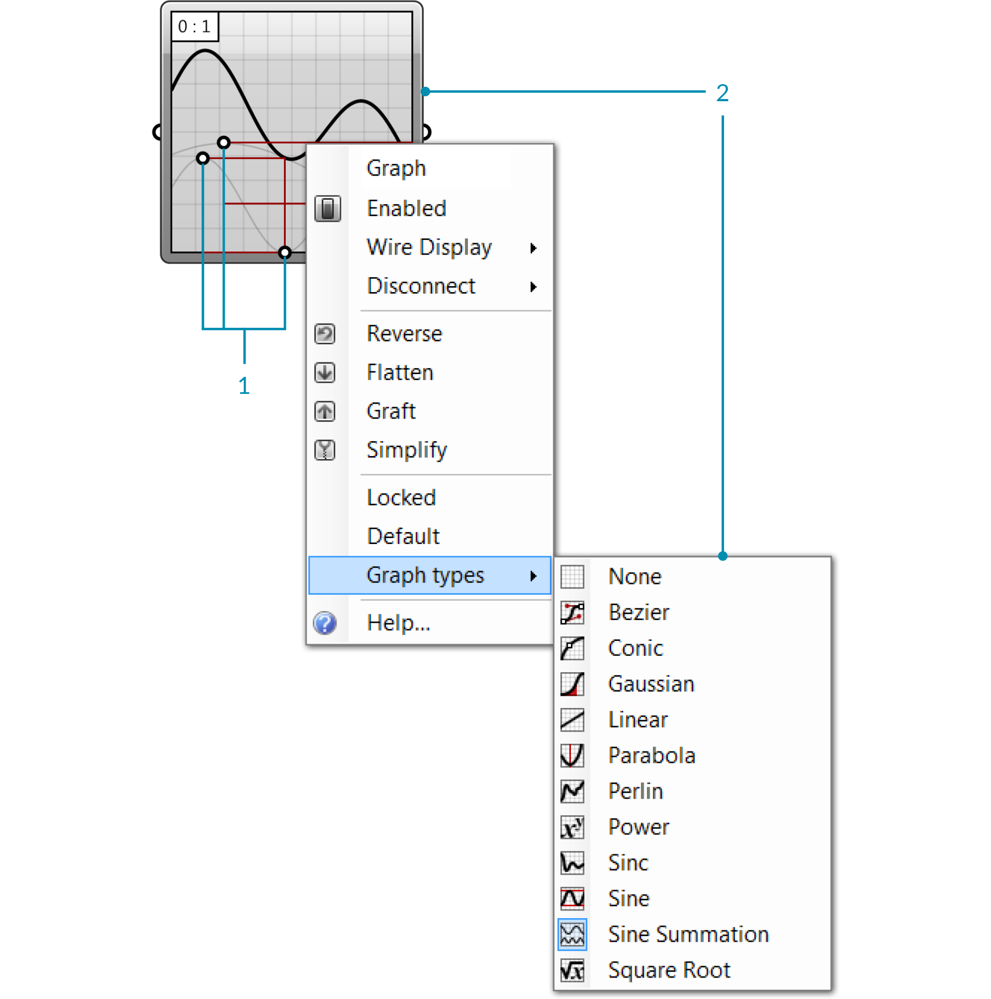
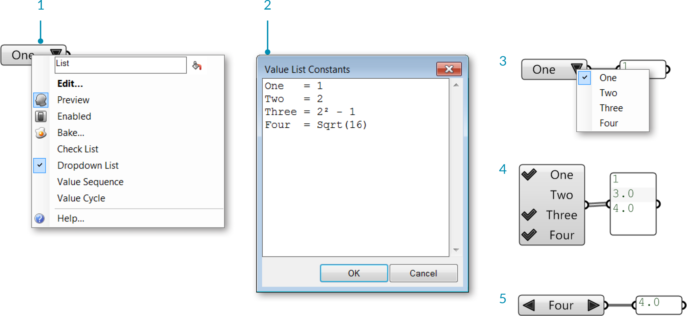

### 1.2.3. ТИПЫ ДАННЫХ

#####Большинство параметров хранят два различных типа данных: изменяемые и постоянные. Изменяемые данные наследуются из одного или более ресурсов и разрушаются (т.е. собирается заново) всякий раз, когда начинается новое решение. Постоянные данные - это данные, которые были специально введены пользователем.

####1.2.3.1. ПОСТОЯННЫЕ ДАННЫЕ
Постоянные данные доступны через меню и, в зависимости от типа параметра, имеют разных управляющих. Параметр Point, например, позволяет вам настроить одну или больше точек через меню. Но, давайте вернемся на несколько шагов назад и посмотрим, как ведет себя параметр Point.

Когда вы перетащили параметр Point из Params/Geometry Panel на холст, параметр оранжевого цвета, сигнализируя о наличии предупреждения. Это не очень страшно, предупреждение просто информирует вас о том, что параметр пустой (не содержит постоянных записей и не может собрать изменяемые данные) и, таким образом, не влияет на результат решения. Контекстное меню параметра предлагает два способа настройки постоянных данных: один и множество. Кликните правой клавишй мыши по параметру, чтобы установить Multiple Points. Когда вы кликнете по какому-либо из этих элементов меню, окно Grasshopper закроется и программа попросит вас выбрать точку в одном из видовых окон Rhino.

Как только вы выберете все точки, нажмите Enter и они станут частью постоянных данных параметра. Это означает, что параметр больше не пустой и он поменяет цвет с оранжевого на серый. (Заметьте, что информационный шарик в правом верхнем углу также исчезнет, так как предупреждения больше нет). В этот момент вы можете использовать точки, хранящиеся в этом параметре, для любого последующего входа в вашем значении.

>1. Оранжевый параметр информирует о том, что параметр не содержит постоянных данных (параметр не смог собрать изменяемые данные), таким образом, не влияет на результат решения. Кликните правой клавишей мыши по любому параметру, чтобы установить его постоянные данные.
2. Как только параметр содержит какие-либо постоянные данные, компонент из оранжевого превращается в серый.
3. Подсказка по инструменту для параметра Point отображает постоянные данные (набор исходных точек), которые он хранит.

####1.2.3.2. ИЗМЕНЯЕМЫЕ ДАННЫЕ
Изменяемые данные, как подразумевает название, не постоянные и будут уничтожаться каждый раз, когда срабатывает решение. Тем не менее, это будет также часто запускать событие для перестроения решения и обновления сцены. Говоря в целом, большая часть данных, сгенерированных "на лету", считается изменяемой.

Как упоминалось раньше, данные Grasshopper хранятся в разделе Параметры (либо в Изменяемой или Постоянной  форме) и используются в различных Компонентах. Когда данные не хранятся в постоянном месте записи в Параметрах, появляется необходимость взять их откуда-то. Каждый Параметр (за исключением параметров выхода) сам определяет, откуда он получает свои данные, и большинство Параметров не очень точно определяют это. Вы можете подключить числовой Параметр (тот, который определяет, что это десятичное число) в целый источник и он возьмет на себя обязанность произвести конвертацию.

Вы можете изменить способ получения данных и способ хранения данных в контекстном меню параметра или входа компонента. Чтобы изменить хранящуюся исходную геометрию Rhino в самом определении Grasshopper, кликните правой клавишей мыши по параметру и выберите Internalise data из меню. Это полезно, если вы хотите, чтобы ваше определение Grasshopper было независимым от файла Rhino.

Вы также можете подключить Internalise data ко входу компонента. Как только вы выберете Internalise data в меню, все связи отсоединяться от этого входа. Данные изменились с изменяемых на постоянные и больше не будут обновляться.

Если вы хотите, чтобы данные снова превратились в изменяемые, просто отсоедините связи от входа и значения автоматически заменятся. Вы также можете кликнуть правой клавишей мыши по входу и выбрать параметр Extract (извлекать). Grasshopper создаст параметр, подключенный связью с входом, которая содержит данные.

####1.2.3.3. ВВОДНЫЕ ПАРАМЕТРЫ
У Grasshopper есть разнообразные параметры, которые дают возможность взаимодействовать с данными, которые поставляются во входы компонента и, таким образом, контролируют изменение результата вашего определения. Из-за того, что параметры меняются с входом, они генерируют изменяемые данные.

**Number Slider**
Цифровой слайдер - это самый важный и широко используемые параметр входа. Он позволяет нам выводить значения между двумя данными экстремумами, путем взаимодействия с его ползунками при помощи нашей мышки. Слайдеры могут использоваться, чтобы указывать значение и наблюдать за изменением нашего определения, которые происходят при перемещении  ползунка, но слайдер также должен рассматриваться как средство определения успешного диапазона нашего определения.

>1. Перемещайте ползунок слайдера, чтобы поменять значение. При каждом перемещении ползунка, Grasshopper будет пересчитывать решение.
2. Кликните правой клавишей мыши по слайдеру, чтобы изменить имя, тип и значение.
3. Редактируемое текстовое поле, которое отображает имя слайдера.
4. Выберите тип числа для использования слайдером.
5. Изменить диапазон значений.
6. Дважды кликните по имени слайдера, чтобы открыть Slider Editor (редактор слайдера).

**Graph mapper**
Graph Mapper - это двух-пространственный интерфейс, с помощью которого вы можете изменять числовые значения, выстраивая вход вдоль оси Х и выводя соответствующие значения вдоль оси Y на пересечении с осью X на графике. Это очень полезно при варьировании набора значений внутри установленного интерфейса с ползунками.

>1. Перемещайте ползунки, чтобы отредактировать график. При каждом перемещении ползунка, Grasshopper будет пересчитывать решение.
2. Кликните правой клавишей мыши по компоненту graph mapper, чтобы выбрать тип графика.

>1. Дважды кликните по graph mapper, чтобы открыть Graph Editor (редактор графика).
2. Измените диапазоны x и y.

**Value List**
Value List (список значений) хранит набор значений с соответствующим списком ярлыков, связанных при помощи знака равенства. Это особенно полезно, когда вы хотите иметь несколько опций, названных по значению, которые могут предоставить специфические значения на выходе.

>1. Кликните правой клавишей мыши по компоненту Value List и выберите опцию из меню.
2. Дважды кликните по компоненту Value List, чтобы открыть редактир и добавить или изменить значения.
3. В режиме Dropdown List (Выпадающий Список) кликните по стрелке, чтобы выбрать одно из значений. Решение будет вычисляться каждый раз, когда вы меняете значение.
4. В режиме Check List (Проверочный список) кликните рядом с каждым значением, чтобы проверить его. Компонент выдаст все значения, которые были проверены.
5. В режимах Value Sequence (Последовательность значений) и Value Cycle (Цикл значений), кликните по левой или правой стрелочке, чтобы пролистать значения.
