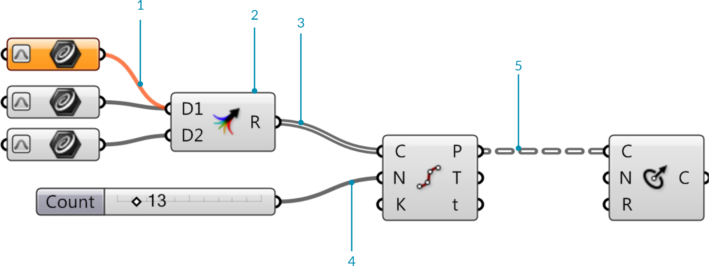

### 1.2.4. КОМПОНЕНТЫ СВЯЗИ

#####Когда данные не хранятся в постоянном месте записи в Параметрах, появляется необходимость взять их откуда-то. Данные передаются из одного компонента в другой посредством связей. Можете представить их себе, буквально, электрическими цепями, которые переносят сигналы данных из одного объекта в следующий объект.

####1.2.4.1. УПРАВЛЕНИЕ СВЯЗЯМИ
Для того, чтобы соединить компоненты, кликните и перетащите рядом с кругом на сторону выхода объекта. Соединительная связь прикрепится к мышке. Как только мышка будет наведена над потенциальным входом, связь подсоединится и станет прочной. Это не постоянная связь, пока вы не отпустите кнопку мыши. Не имеет значения, как мы осуществим подключения - слева-направо или справа-налево.

>1. Компонент Divide Curve - разделяет кривую на равные по длине сегменты.
2. Параметр Curve (кривая) - кликните правой клавишей мыши и выберите Set One Curve (установить одну кривую), чтобы привязаться к геометрии Rhino.

>Кликните левой клавишей мыши и перетащите связь из выхода (1) одного объекта в выход (2) другого объекта.

>4. Если вы зажмете CONTROL, курсор станет красного цвета и целевой источник удалится из списка ресурсов.
5. По умолчанию, новое соединение удалит существующее соединение. Зажмите SHIFT во время перемещения соединений, чтобы выбрать множество источников. Курсор станет зеленого цвета, т.о. отображая дополнительное поведение.

>6. Вы также можете разъединить связь через контекстное выпадающее меню - правый клик по ползунку входа или выхода и выберите разъединить.
7. При наличии нескольких соединений, выберите одно, которое вы хотите отсоединить от списка.
8. При наведении мышки на элемент, связь подсветиться красным.

####1.2.4.2. FANCY СВЯЗИ
Связи представляют соединения так же как поток данных внутри графика в нашем определении. Grasshopper может также давать нам визуальные подсказки о том, что протекает через связи. Настройки по умолчанию, так называемые, "fancy wires" отключены, поэтому вам необходимо включить их до того как вы сможете просматривать различные типы линий для соединительных связей. Чтобы выполнить это, просто кликните на Display Tab в Строке основного меню и выберите кнопку "Draw Fancy Wires.” Fancy wires могут поведать много информации о том, какой тип информации протекает из одного компонента в другой.

>1. Empty Item - тип связи оранжевого цвета, сигнализирует о том, что никакой информации не передается. Этот параметр генерирует предупреждающее сообщение, потому что оно не содержит данных и, поэтому, никакой информации не транслируется по связям.
2. Компонент Merge - это альтернатива подключению больше, чем одного источника к одному входу.
3. List - если информация, исходящая из компонента, содержит список информации, тип связи будет отображаться двойной серой линией.
4. Single Item - поток данных из любого параметра, который содержит один элемент, будет показан цельной серой линией.
5. Tree (дерево) - информация, передающаяся между компонентами, которые содержат структуры данных, отображается связью серой двойной линией с точками.

####1.2.4.3. ОТОБРАЖЕНИЕ СВЯЗЕЙ
Если вы уже провели достаточно много времени работая над одним определением Grasshopper, вы уже столкнулись с тем, что холст сильно и быстро захламляется "гнездами" связей. К счастью, у нас есть возможность управлять отображением связей для каждого входа компонента.

Существуют три вида отображения связей: Default Display (по умолчанию), Faint Display (исчезающее отображение), and Hidden Display (скрытое отображение). Чтобы изменить отображение связи, просто кликните правой клавишей мыши на любом входе компонента и выберите один из видов, доступных под Wire Display в выпадающем меню.

>1. Hidden Display - когда выбран этот режим, связь будет абсолютно не видимой. Данные передаются "беспроводным" путем от источника к параметру входа. Если вы выберете исходный или конечный компонент, появится зеленая связь, которая показывает какие компоненты соединены с какими компонентами. При отмене выбора компонента, связь исчезнет.
2. Default Display (отображение по умолчанию) - отображение связи по умолчанию отобразит все соединения (при условии, что fancy wires отключены).
3. Faint Display - исчезающее отображение связей будет отображать соединение связей очень тонкими полупрозрачными линиями. Faint и Hidden отображение связей могут очень полезны, если в один вход входит несколько исходных связей.
