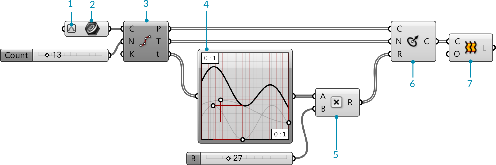
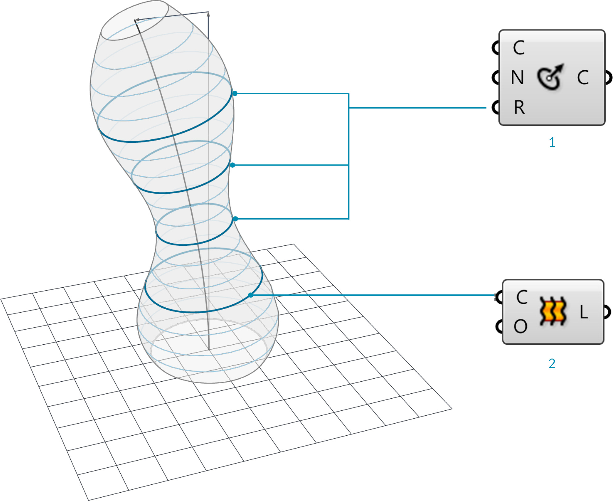

### 1.2.5. ОПРЕДЕЛЕНИЕ GRASSHOPPER

>Файлы упражнения, которые сопровождают этот раздел: [http://grasshopperprimer.com/appendix/A-2/1_gh-files.html](http://grasshopperprimer.com/appendix/A-2/1_gh-files.html)

>Файлы упражнения, которые сопровождают этот раздел: [Download](../../appendix/A-2/gh-files/1.2.5_the grasshopper definition.gh)


#####У определений Grasshopper есть процесс работы программы, который отображает, где начать выполнение программы, что делать в середине и как узнать, когда выполнение программы закончено.

####1.2.5.1. ПРОЦЕСС РАБОТЫ ПРОГРАММЫ
Визуальные программы Grasshopper выполняются слева направо. Чтение графика, связанного с соединениями связей из upstream с downstream, предоставляет понимание о процессе работы программы.

>Направление данных слева направо.

####1.2.5.2. ЛОГИЧЕСКИЙ ГРАФИК
Все объекты и связи, соединяющие объекты, представляют логический график нашей программы. Этот график показывает поток данных, взаимозависимости каждого входа от подключенного выхода. Каждый раз когда график изменяется, иногда в связи с "загрязненностью", каждое соединение downstream и объект будут обновляться.

>1. Перепараметризировать домейн кривой между 0.0 и 1.0.
2. Ссылка на кривую из Rhino.
3. Разделить кривую на 13 равных сегментов.
4. Запустить значение параметров на каждой точке деление кривой через график.
5. Умножьте каждое значение на 27.
6. Нарисуйте круг у каждой точки деления вдоль кривой, нормальный тангенс вектор у каждой точки с радиусом, определяемым значением параметра (t), изменяемым при помощи graph mapper и умноженным на 27.
7. Пространство между поверхностями кругов.

>1. Изменяемый радиус круга.
2. Пространство между кругами
