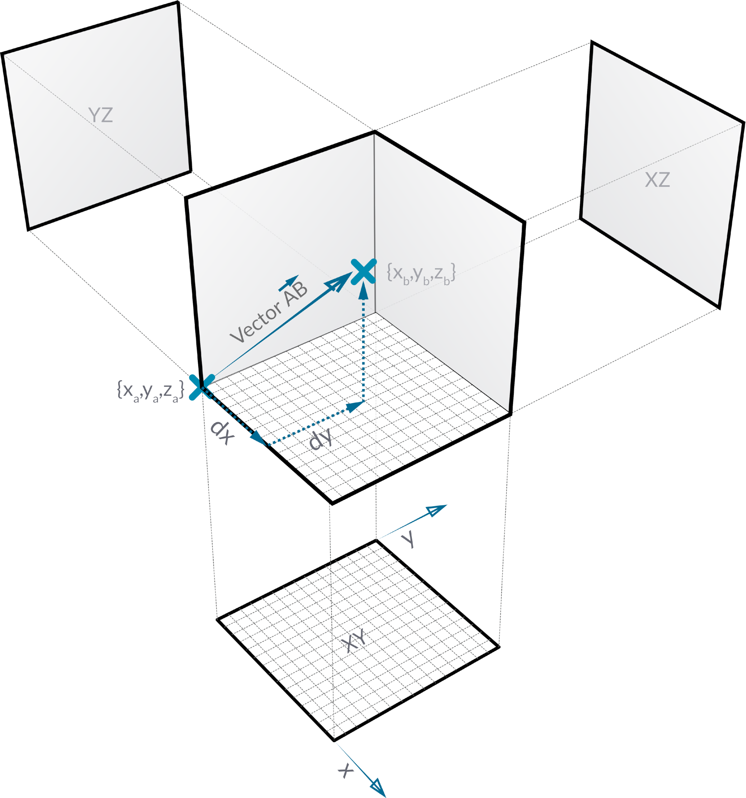
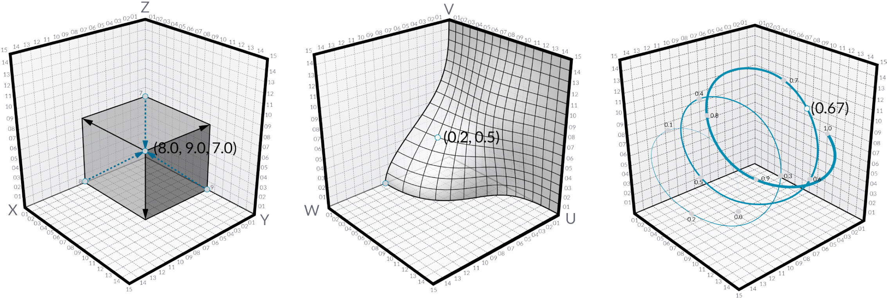
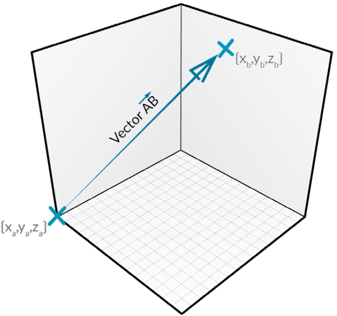
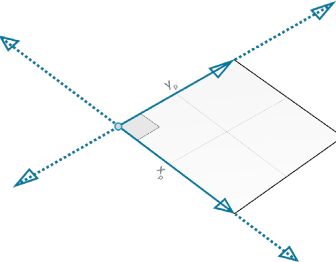

###1.3.1. Точки, плоскости и векторы

#####Все начинается с точки. Точка - это ничего более, чем одно или несколько значений, называемых координатами. Число значений координат соответствует числу измерений пространства, в котором оно располагается. Точки, плоскости и векторы - это основа для создания и трансформации геометрии в Grasshopper.

####1.3.1.1 ТОЧКИ
Точки в пространстве 3D имеют три координаты - обычно их обозначают [x,y,z]. Точки в пространстве 2D имеет только две координаты, которые обозначают либо [x,y] либо [u,v], в зависимости от того, о каком двухмерном пространстве мы говорим. 2D параметрическое пространство ограничено конечной поверхностью. Тем не менее, она все-таки непрерывная, т.е. гипотетически существует бесконечное число точек на поверхности, но максимальное расстояние между этими точками очень сильно ограничено. 2D параметрические координаты действительны, только если они не превышают определенный диапазон. На примере показано, что диапазон был установлен от 0.0 до 1.0  для обоих направлений [u] и [v], но также это может быть и любой конечный диапазон. Точка с координатами [1.5, 0.6] будет находиться где-то снаружи поверхности и, поэтому, не будет работать.

Так как поверхность, которая определяет это параметрическое пространство находится в правильном 3D пространстве, мы всегда можем переместить параметрическую координату в координату 3D пространства. Точка [0.2, 0.5] на поверхности, например, такая же как точка [1.8, 2.0, 4.1] в мировых координатах. Как только мы изменили поверхность, 3D координаты, которые связаны с [0.2, 0.5] будут меняться.

Если это сложная идея для понимания, то вам может помочь следующее - представить себя и свое положение в пространстве. Мы обычно используем местную систему координат, чтобы описать наше положение: "Я сижу на третьем месте седьмого ряда в кинотеатре", "Я на заднем сидении". Если вы находитесь в автомобиле, едущем по дороге, ваше положение в системе глобальных координат будет меняться все время, даже если вы остаетесь сидеть в том же самом кресле.

####1.3.1.2. ВЕКТОРЫ
Вектор - это геометрическая величина, описывающая Направление и Амплитуду.
Векторы абстрактны, т.е. они представляют величину, а не геометрический элемент.

Векторы неотделимы от точек. Так как, они оба представляют собой список из трех чисел, поэтому совершенно нет возможности определить, что представляет из себя некий список - точку или вектор. Хотя на практике разница есть; точки абсолютны, векторы относительны. Когда мы относимся к списку из трех пар как к точке - она представляет определенную координату в пространстве, когда мы относимся к нему как к вектору, он представляет собой определенное направление. Вектор - это стрелка в пространстве, которая всегда начинается с мировых координат (0.0, 0.0, 0.0) и заканчивается в указанной координате.

####1.3.1.3. ПЛОСКОСТИ
Плоскости - "плоские" и вытягиваются бесконечно в двух направлениях, определяя локальную систему координат. Плоскости не подлинные объекты в Rhino, они используются для определения системы координат 3D пространстве. На деле, лучше думать о плоскостях как о векторах, т.к. это просто математические структуры.

