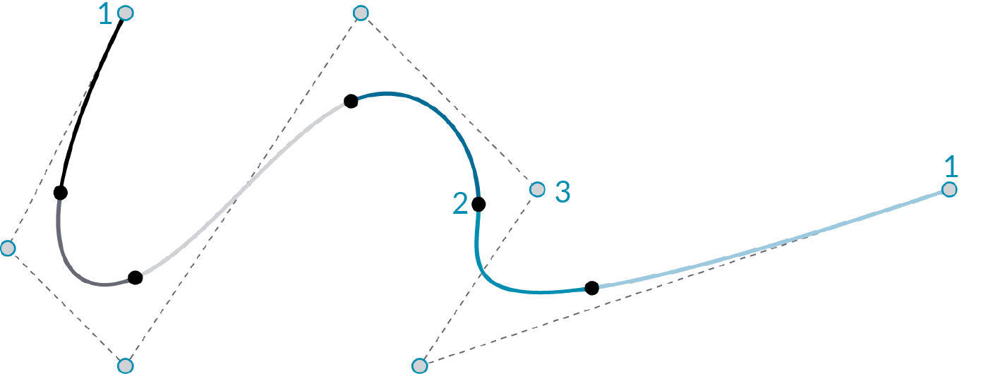

### 1.4.1. ГЕОМЕТРИЯ КРИВОЙ

#####NURBS (неоднородные рациональные Б-сплайны) - математическое представление, которое может точно смоделировать любую форму из простой 2D линии, круга, арки или коробки в самую сложную 3D произвольной формы органическую поверхность или тело. Благодаря своей гибкости и точности, NURBS модели могут использоваться в любом процессе от иллюстрации и анимации до производства.

Так как кривая является геометрическим объектом, она обладает некоторым числом характеристик, которые можно использовать для ее описания или анализа. Например, каждая кривая имеет начальную координату, и каждая кривая имеет конечную координату. Когда расстояние между этими двумя координатами равно нулю, кривая замкнута. Также, у каждой кривой есть некое число контрольных точек, если все эти точки расположены на одной плоскости, кривая, в целом, будет планарной. Некоторые характеристики применимы ко всей кривой, в целом, в то время как другие применимы к особым точкам на кривой. Например, планарность - это универсальная характеристика, в то время как тангенс векторы - это узкая характеристика. Также, некоторые характеристики применимы только к некоторым типам кривых. На данный момент мы обсудили некоторые компоненты Grasshopper из раздела Primitive Curve, такие как линии, круги, эллипсы и арки.

>1. Линия
2. Полилиния
3. Круг
4. Эллипс
5. Арка
6. NURBS кривая
7. Поликривая

>1. Конечная точка
2. Точка редактирования
3. Контрольная точка

####1.4.1.1. КРИВЫЕ NURBS
**Порядок:** Порядок это положительное целое число. Обычно это число 1, 2, 3 или 5, но это может быть любое положительное целое число. Порядок кривой определяет степень влияния контрольных точек на кривую, где чем выше порядок, тем больше степень влияния. NURBS линии и полилинии обычно имеют порядок 1, NURBS круги - порядок 2, большая часть кривых произвольной формы порядок 3 или 5.

**Контрольные точки:** Контрольные точки - это списки точек, у которых порядок+1, по меньшей мере. Один из самых легких способов изменить форму NURBS кривой - переместить контрольные точки.

**Вес:** Контрольные точки имеют соответствующие им числа, называемые весом. Вес обычно положительное число. Когда контрольные точки кривой имеют одинаковый вес (обычно 1), кривая называется нерациональной, в противном случае, кривая называется рациональной. Большинство NURBS кривых являются нерациональными. Несколько NURBS кривых, таких как круги и эллипсы, всегда являются рациональными.

**Узлы:** Узлы - это список чисел (порядок+N-1), где N - число контрольных точек.

**Точки редактирования:** Точки на кривой определяются по средней величине узла. Точки редактирования похожи на контрольные точки, за исключением того, что они всегда располагаются на кривой и при перемещении одной точки редактирования, будет меняться форма всей кривой (перемещая одну контрольную точку, форма кривой будет меняться локально). Точки редактирования полезны, когда вам нужна точка на кривой, чтобы она проходила точно через определенный участок.

NNURBS кривые образуют узел как результат различного порядка:

>A D1 кривая ведет себя также как полилиния. A D1 кривой есть узел для каждой контрольной точки.

>D2 NURBS кривые обычно используются только для аппроксимации арок и кругов. Сплайн пересекается с контрольным полигоном наполовину каждого сегмента.

>D3 это самый распространенный тип NURBS кривой и он включен по умолчанию в Rhino. Возможно вы знакомы с визуальной прогрессией сплайна, даже хотя узлы и появляются в странных местах.

####1.4.1.2. КОМПОНЕНТЫ СПЛАЙН GRASSHOPPER

>Файлы упражнения, которые сопровождают этот раздел: [http://grasshopperprimer.com/appendix/A-2/1_gh-files.html](http://grasshopperprimer.com/appendix/A-2/1_gh-files.html)

>Файлы упражнения, которые сопровождают этот раздел: [Download](../../appendix/A-2/gh-files/1.4.1.2_grasshopper spline components.gh)


Grasshopper обладает набором инструментов для передачи более продвинутых типов кривых Rhino, таких как NURBS кривые и поликривые. Эти инструменты можно найти во вкладке Curve/Splines.

**Nurbs Curve** (Curve/Spline/Nurbs curve): Компонент Nurbs Curve
создает NURBS кривую из контрольных точек. Вход V определяет эти точки, которые могут быть описаны косвенно путем выбора точек из Rhino или путем наследования изменяемых данных из других компонентов. Вход D компонента Nurbs Curve устанавливает порядок кривой.

**Interpolate Curve** (Curve/Spline/Interpolate): Интерполированные кривые ведут себя немного по-другому, чем NURBS кривые. Вход V для компонента, похожего на компонент NURBS в том, что он требует особый набор точек для создания кривой. Тем не менее, при применении метода интерполированной кривой, полученная кривая будет проходить через эти точки, вне зависимости от порядка кривой. В компоненте NURBS кривой, мы можем добиться этого, только когда порядок кривой был установлен на 1. Также, как и компонент NURBS кривая, вход D определяет порядок итоговой кривой.
Тем не менее, при применении этого метода, используются только нечетные числовые значения для входа порядка. Снова, вход P определяет, является ли кривая периодической (Periodic). Вы начнете видеть некий паттерн в выходах для многих компонентов кривой, в том плане, что выходы C, L и D указывают, в основном, итоговую кривую, длину и диапазон кривой соответственно.

**Kinky Curve** (Curve/Spline/Kinky Curve): Компонент kinky curve позволяет вам контролировать особые предельные значения угла, А, где кривая осуществит переход от узловатой линии к сглаженной, интерполированной кривой. Следует отметить, что вход А требует ввода в радианах.

**Polyline** (Curve/Spline/Polyline): Полилиния - это набор сегментов линии, соединяющих две или более точек, результирующая линия будет всегда проходить через ее контрольные точки, что схоже с Interpolated Curve. Как вышеуказанные типы кривых, вход V компонента Polyline указывают набор точек, которые будут определять границы каждого сегмента линии, составляющей полилинию. Вход C компонента определяет является ли полилиния открытой или закрытой кривой. Если расположение первой точки не совпадает с расположением последней точки, будет создаваться сегмент линии для закрытия loop. Выход компонента Polyline отличается от предыдущих примеров в том, что в результате получается только сама кривая.

