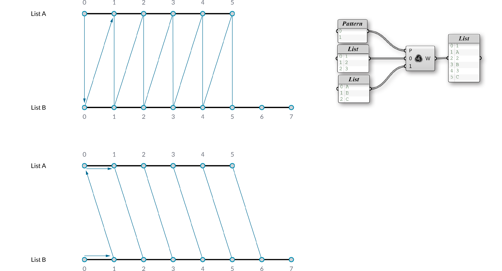
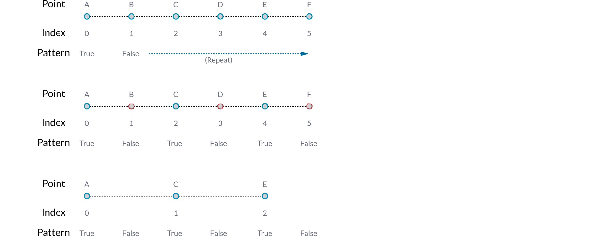

### 1.4.6. Управление Списком

>Файлы упражнения, которые сопровождают этот раздел: [http://grasshopperprimer.com/appendix/A-2/1_gh-files.html](http://grasshopperprimer.com/appendix/A-2/1_gh-files.html)

>Файлы упражнения, которые сопровождают этот раздел: [Download](../../appendix/A-2/gh-files/1.4.6_list management.gh)


#####Одна из самых мощных характеристик Grasshopper - это способность быстро строить и изменять различные списки данных. Мы можем хранить много различных типов данных в списке (числа, точки, векторы, кривые, поверхности, брепы и т.д.), существуют полезные для этого инструменты в разделе Sets/List.

####1.4.6.1. ДЛИНА СПИСКА
Компонент List Length (Sets/List/List Length) измеряет длину списка. Из-за того, что наши списки всегда начинаются с нуля, самый большой возможный индекс в списке равняется длине списка минус один. В этом примере, мы соединили наш базовый Список с входом L компонента List Length, показывая 6 значений в списке.

####1.4.6.2. КОМПОНЕНТ LIST ITEM
Наш список вводится в компонент List Item (Sets/List/List Item), чтобы выносить особые элементы данных изнутри массива данных. При получении индивидуальных элементов списка, мы должны указать i вход, который соответствует индекс числу, которое мы хотели бы извлечь. Мы можем внести одно целое или список целых чисел в i вход в зависимости от того, как много элементов мы хотели бы извлечь. Вход L определяет базовых список, который мы будем анализировать. В этом примере, мы установили i вход на 2, так что компонент List Item выдает элементы данных, связанных с 3-м вводным числом в нашем списке.

####1.4.6.3. КОМПОНЕНТ REVERSE LIST
Мы можем инвертировать порядок в нашем списке, используя компонент Reverse List (Sets/ List/Reverse). Если мы введем список возрастающих чисел от 0.0 до 50.0 в компонент Reverse List; выход выдаст убывающий список от 50.0 до 0.0.

####1.4.6.4. КОМПОНЕНТ SHIFT LIST
Компонент Shift List (Sets/Sequence/Shift List) будет либо перемещать элементы в списке вверх или вниз на какой-то шаг, в зависимости от значения смещения. Мы подключили выход List ко входу Shift-L, в тоже время подключив число ко входу Shift-S. Если мы установим смещение на -1, все значения списка будут смещаться вниз на одно число. Точно также, если мы изменим смещение на +1, все значения списка будут смещаться вверх на одно число. Если вход Wrap равняется True (правда), то элементы, которые не попадают в границы, будут крепиться к началу или концу списка. В этом примере, мы поставили значение смещения на +1, так что наш список смещается на одно значение вверх. Теперь, нам предстоит решить, как нам поступить с первым значением. Если мы установим значение Wrap на False (ложь), то первое значение будет смещаться вверх и выходить из списка, главным образом, удаляя это значение из набора данных (так что длина списка на один меньше, чем была до этого).
Тем не менее, если мы установим значение Wrap на True, первое значение переместиться к концу списка

####1.4.6.5. КОМПОНЕНТ INSERT ITEMS
Компонент Insert Items (Sets/Lists/Insert Items) позволяет вставлять набор элементов в список. Для того чтобы это все работало как надо, вам необходимо знать элементы, которые вы хотите вставить и индекс положение для каждого нового элемента. В примере ниже, мы вставим буквы A, B и C на индекс положение три.

####1.4.6.6. КОМПОНЕНТ WEAVE
Компонент Weave (Sets/Lists/Weave) смешивает два или более списка вместе, на основе указанного паттерна плетения (P вход). Когда паттерн и направление (поток) не совпадают идеально, этот компонент может либо вставить неизвестные значения в выходы потоков или может игнорировать потоки, которые уже были исчерпаны.

####1.4.6.7. КОМПОНЕНТ CULL PATTERN
Компонент Cull (Sets/Sequence/Cull Pattern) удаляет элементы в списке, используя повторяющуюся битовую маску. Битовая маска определяется как список булевых значений. Битовая маска повторяется до тех пор, пока все элементы из списка данных не будут определены.

