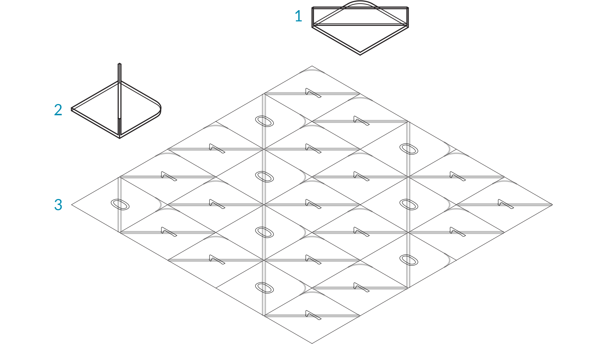
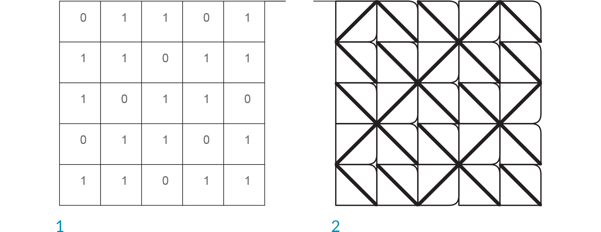
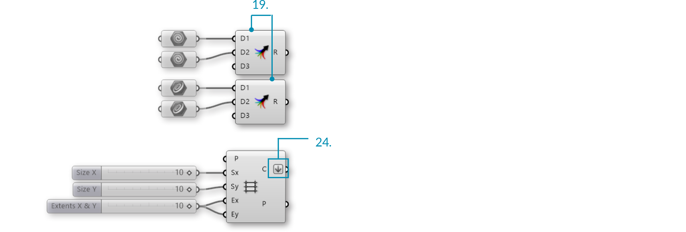
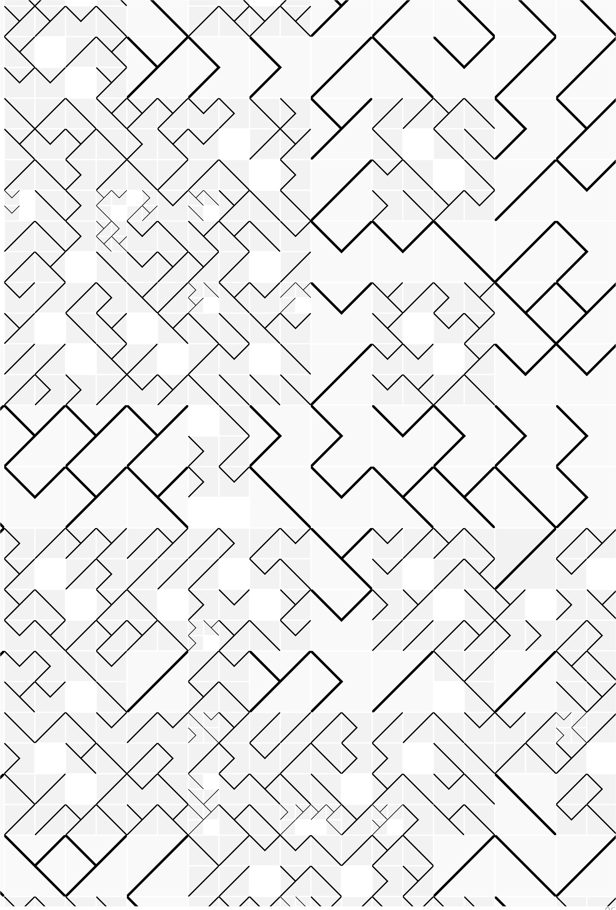

### 1.4.7. РАБОТА СО СПИСКАМИ

>Файлы упражнения, которые сопровождают этот раздел: [http://grasshopperprimer.com/appendix/A-2/1_gh-files.html](http://grasshopperprimer.com/appendix/A-2/1_gh-files.html)


>Файлы упражнения, которые сопровождают этот раздел: [Download](../../appendix/A-2/gh-files/1.4.7_working with lists.gh)



Давайте посмотрим на пример, используя компоненты из предыдущего раздела. В этом примере мы создаем рисунок под плитку применяя перенос геометрии к прямоугольной сетке. Этот паттерн создается путем использования компонента List Item для извлечения желаемой плитки из списка геометрии.

>1. Геометрия соответствует индексу 1
2. Геометрия соответствует индексу 0
3. Прямоугольная сетка

>1. Перенесенный паттерн
2. Перенесенная геометрия

||||
|--|--|--|
|01.| Запустите файл Rhinoceros. ||
|02.| Создайте два равных по размеру квадрата.||
|03.| Создайте различную геометрию в каждом квадрате. <blockquote>В примере выше, мы создали простую поверхность с вкладкой.Вкладка скруглена, чтобы продемонстрировать ориентацию, и основа скруглена, чтобы различить две геометрии.</blockquote>||
|04.| Запустите новое определение набрав Ctrl+N (в Grasshopper).||
|05.| Зайдите в **Params/Geometry/Geometry** – перетащите два параметра **Geometry** на холст.| |
|06.| Кликните правой клавишей мыши по первому параметру **Geometry** и выберите set one Geometry. Укажите первую геометрию, к которой вы делаете привязку. ||
|07.| Кликните правой клавишей мыши по второму параметру **Geometry** и выберите set one Geometry. Укажите вторую геометрию, к которой вы делаете привязку.  <blockquote>Можно сделать привязку к нескольким геометриям в одном параметре, но для простоты мы использовали два отдельных параметра.</blockquote>||
|08.| Зайдите в **Params/Geometry/Curve** – вытащите два параметра **Curve** на холст.||
|09.| Кликните правой клавишей мыши по первому параметру **Curve** и выберите set one Curve. Укажите первый квадрат, к которому вы делаете привязку.||
|10.| Кликните правой клавишей мыши по второму параметру **Curve** и выберите set one Curve. Укажите второй квадрат, к которому вы делаете привязку.  <blockquote>Убедитесь, что геометрия и квадрат, на который вы ссылаетесь, находятся в соответствии.</blockquote>||
|11.| Зайдите в **Vector/Grid/Rectangular** – перетащите компонент **Rectangular Grid** на холст. ||
|12.| Зайдите в **Params/Input/Slider** - перетащите три слайдера **Number Sliders** на холст. ||
|13.| Дважды кликните по первому слайдеру **Number Slider** и установите следующее:<ul>Rounding: Integers Lower Limit: 0 Upper Limit: 10 Value: 10 </ul>||
|14.| Дважды кликните по второму слайдеру **Number Slider** и установите следующее:<ul>Rounding: Integers Lower Limit: 0 Upper Limit: 10 Value: 10 </ul>||
|15.| Дважды кликните по третьему слайдеру **Number Slider** и установите следующее:<ul>Name: Extents X & Y Rounding: Integers Lower Limit: 0 Upper Limit: 10 Value: 10 </ul>||
|16.| Соедините первый **Number Slider** с входом Size X (Sx) компонента **Rectangular Grid**.||
|17.| Соедините второй **Number Slider** с входом Size Y (Sy) компонента **Rectangular Grid**.||
|18.| Соедините третий **Number Slider** с входом Extent X (Ex) и входом Extent Y (Ey) компонента **Rectangular Grid**.|||

||||
|--|--|--|
|19.| Зайдите в **Sets/Tree/Merge** – вытащите два компонента **Merge** на холст.||
|20.| Соедините первый параметр **Geometry** с входом Data Stream 1 (D1) первого компонента **Merge**. ||
|21.| Соедините второй параметр **Geometry** с входом Data Stream 2 (D2) первого компонента **Merge**. ||
|22.| Соедините первый параметр **Curve** с входом Data Stream 1 (D1) второго компонента **Merge**. ||
|23.| Соедините второй параметр **Curve** с входом Data Stream 1 (D2) второго компонента **Merge**. ||
|24.| Кликните правой клавишей мыши на выходе Cells (C) компонента **Rectangular Grid** и выберите Flatten. |||

||||
|--|--|--|
|25.| Зайдите в **Sets/List/List Length** – вытащите компонент **List Length** на холст.||
|26.| Соедините выход Cells (C) компонента **Rectangular Grid** со входом List (L) компонента **List Length**. ||
|27.| Зайдите в **Sets/Sequence/Repeat Data** – перетащите компонент **Repeat Data** на холст.||
|28.| Соедините выход Length (L) компонента **List Length** со входом Length (L) компонента **Repeat Data**. ||
|29.| Зайдите в **Params/Input/Panel** – перетащите **Panel** на холст.||
|30.| Дважды кликните по **Panel**. Снимите выделение с multiline data, wrap items и special codes. Введите следующее:<ul>1 0 0</ul> <blockquote>Это паттерн, в котором распространяются геометрии. 0 вызывает первую исходную Geometry, 1 вызывает вторую исходную Geometry. Изменяя числовую последовательность будет меняться паттерн, также как будет меняться протяженность сетки.</blockquote>||
|31.| Соедините **Panel** с входом Data (D) компонента **Repeat Data**.|||

||||
|--|--|--|
|32.| Зайдите в **Sets/List/List Item** – перетащите два компонента **List Item**.||
|33.| Соедините выход Result (R) первого компонента **Merge** с входом List (L) первого компонента **List Item**.||
|34.| Соедините выход Result (R) второго компонента **Merge** с входом List (L) второго компонента **List Item**.||
|35.| Соедините выход Data (D) второго компонента **Repeat Data** с входом Index (i) первого и второго компонентов **List Item**.||
|36.| Зайдите в **Transform/Affine/Rectangle Mapping** – перетащите **Rectangle Mapping** компонент на холст.||
|37.| Соедините выход Cells (C) компонента **Rectangular Grid** со входом Target (T) компонента **Rectangular Mapping**.||
|38.| Соедините выход items (I) первого компонента **List Item** с входом Geometry (G) компонента **Rectangular Mapping**.||
|39.| Соедините выход items (I) второго компонента **List Item** с входом Source (S) компонента **Rectangular Mapping**.|||

При изменении вводной геометрии и паттерна будет меняться итоговый паттерн плитки.

