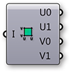
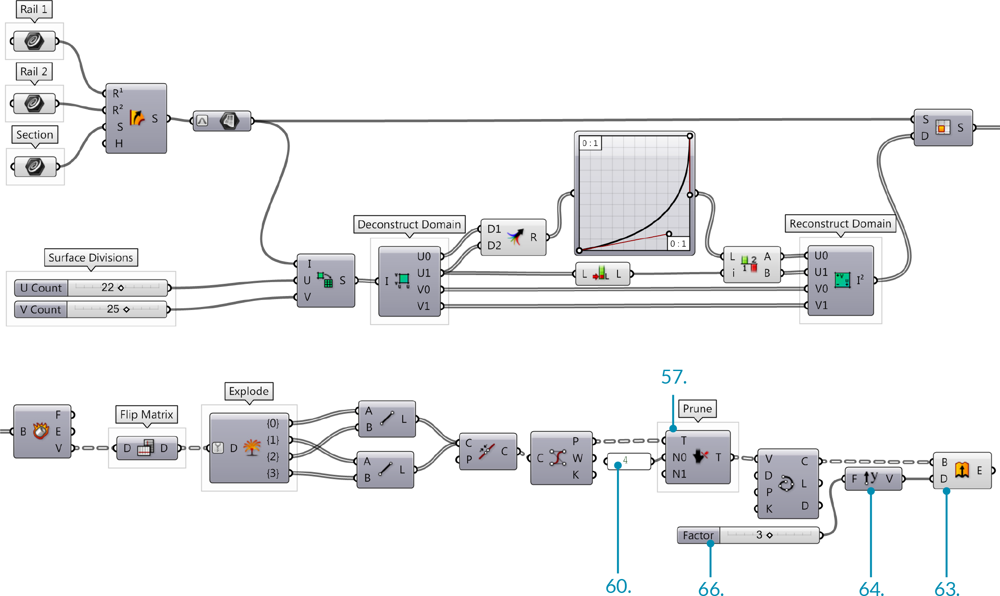

### 1.5.4. Работа с Деревьями Данных

>Файлы упражнения, которые сопровождают этот раздел: [http://grasshopperprimer.com/appendix/A-2/1_gh-files.html](http://grasshopperprimer.com/appendix/A-2/1_gh-files.html)

>Файлы упражнения, которые сопровождают этот раздел: [Download](../../appendix/A-2/gh-files/1.5.4_rail intersect definition.gh)


В этом примере, мы будем использовать некоторые инструменты Grasshopper для работы с деревьями данных для извлечения, реорганизации и интерполяции нужных точек, содержащихся в дереве данных и создания решетки пересекающихся ребер.

>1. Проведите две перекладины для создания NURBS поверхности.
2. Разделите поверхность на сегменты, переменного размера, исключите вершины. Данные, собранные в один список с четырьмя элементами для каждого сегмента.
3. Сделайте Flip матрицы, чтобы изменить структуру данных. Данные, собранные из четырех списков, каждый содержит одну угловую точку каждого сегмента.
4. Разбейте дерево, чтобы соединить угловые точки и прорисовать диагональные линий через каждый сегмент.
5. Сократите дерево до cull веток, содержащих неполные точки, чтобы создать NURBS кривую третьего порядка и интерполировать точки.
6. Вытянуть кривые, чтобы создать пересекающиеся окончания.

||||
|--|--|--|
|01.| Запустите новое определение, набрав Ctrl+N (в Grasshopper) ||
|02.| Зайдите в **Params/Geometry/Curve** – перетащите три параметра **curve** на холст ||
|03.| Зайдите в **Surface/Freeform/Sweep2** – перетащите компонент **Sweep2** на холст||
|04.| Кликните правой клавишей мыши по первому параметру **Curve** и выберите “Set one curve.” Выберите первую rail кривую в видовом окне Rhino||
|05.| Кликните правой клавишей мыши по второму параметру **Curve** и выберите “Set one curve.” Выберите вторую rail кривую в видовом окне Rhino||
|06.| Кликните правой клавишей мыши по третьему параметру **Curve** и выберите “Set one curve.” Выберите кривую в видовом окне Rhino||
|07.| Соедините выходы параметров **Curve** с входами Rail 1 (R1), Rail 2 (R2) и Sections (S) компонента **Sweep2** соответственно|||

>Мы только что создали NURBS поверхность

||||
|--|--|--|
|08.| Зайдите в **Params/Geometry/Surface** – вытащите параметр **Surface** на холст||
|09.| Соедините выход Brep (S) компонента **Sweep2** с входом параметра **Surface**||
|10.| Кликните правой клавишей мыши по параметру **Surface** и выберите “Reparameterize”.  <blockquote>На этом шаге мы заново перенесли диапазоны u и v поверхности между 0 и
1. Это позволит совершить дальнейшие операции.</blockquote>||
|11.| Зайдите в **Maths/Domain/Divide Domain2** – перетащите компонент **Divide Domain2** на холст||
|12.| Зайдите в **Params/Input/Number Slider** – вытащите два слайдера **Number Sliders**на холст||
|13.| Дважды кликните по первому **Number Sliders** и установите следующее:<ul>Rounding: Integer Lower Limit: 1 Upper Limit: 40 Value: 20</ul>||
|14.| Установите такие же значения на втором **Number Sliders**||
|15.| Соедините выход репараметризированого параметра **Surface** с входом Domain (I) компонента **Divide Domain2**||
|16.| Подключите первый **Number Sliders** к входу U Count (U) в компоненте **Divide Domain2**||
|17.| Подключите второй **Number Sliders** к входу V Count (V) в компоненте **Divide Domain2**||
|18.| Зайдите в **Surface/Util/Isotrim** – вытащите компонент **Isotrim** на холст||
|19.| Соедините выход Segments (S) компонента **Divide Domain2** с входом Domain (D) компонента **Isotrim**||
|20.| Соедините выход параметра **Surface** с входом Surface (S) компонента **Isotrim**|||

>Сейчас мы разделили поверхность на небольшие, легко измеримые, поверхности. Настройте слайдеры U и V Count для изменения числа подразделений. Давайте добавим Graph Mapper, чтобы размеры сегментов стали переменными.

||||
|--|--|--|
|21.| Зайдите **Maths/Domain/Deconstruct Domain2** – вытащите компонент **Deconstruct Domain2** на холст||
|22.| Зайдите **Maths/Domain/Construct Domain2** – вытащите компонент **Construct Domain2** на холст||
|23.| Зайдите в **Params/Input/Graph Mapper** – вытащите **Graph Mapper** на холст||
|24.| Зайдите в **Sets/List/List Length** – вытащите компонент **List Length** на холст||
|25.| Зайдите в **Sets/Tree/Merge** – вытащите компонент **Merge** на холст||
|26.| Зайдите в **Sets/List/Split List** – вытащите компонент **Split List** на холст  <blockquote>Компоненты Merge и Split используются, чтобы тот же самый Graph Mapper мог использоваться для обоих значений U min и U max.</blockquote>||
|27.| Соедините выходы U min (U0) и U max (U1) компонента **Deconstruct Domain2** с входами Data 1 (D1) и Data 2 (D2) компонента **Merge**||
|28.| Соедините выход Result (R) компонента **Merge** с входом **Graph Mapper**||
|29.| Кликните правой клавишей мыши по **Graph Mapper** и выберите “Bezier” в “Graph Types”||
|30.| Соедините второй связью из выхода U max (U1) компонента **Deconstruct Domain2** с входом List (L) компонента **List Length**||
|31.| Соедините выход **Graph Mapper** с входом List (L) компонента **Split List**||
|32.| Соедините выход Length (L) компонента **List Length** со входом Index (i) компонента **Split List**||
|33.| Соедините выход List A (A) компонента **Split List** с входом U min (U0) компонента **Construct Domain2**||
|34.| Соедините выход List B (B) компонента **Split List** с входом U max (U1) компонента **Construct Domain2**||
|35.| Соедините выход V min (V0) компонента **Deconstruct Domain2** с входом V min (V1) компонента **Construct Domain2**||
|36.| Соедините выход V max (V1) компонента **Deconstruct Domain2** с входом V max (V1) компонента **Construct Domain2**||
|37. |Соедините выход 2D Domain (I2) компонента **Construct Domain2** с входом Domain (D) компонента **Isotrim**, заменяя существующую связь|||

>Мы только что поменяли строение диапазонов каждого сегмента поверхности, заново перенесли значения U, используя Graph Mapper, и реконструировали диапазоны. Настройте ползунки Graph Mapper чтобы изменить распределение сегментов поверхности. Давайте используем Деревья Данных для работы с подразделениями поверхности.

||||
|--|--|--|
|38.| Зайдите в **Surface/Analysis/Deconstruct Brep** – вытащите компонент **Deconstruct Brep** вытащите компонент||
|39.| Зайдите в **Sets/Tree/Flip Matrix** – вытащите компонент **Flip Matrix** на холст||
|40.| Зайдите в **Sets/Tree/Explode Tree** – вытащите компонент **Explode Tree** на холст||
|41.| Соедините выход Surface (S) компонента **Isotrim** с входом Brep (B) компонента **Deconstruct Brep**  <blockquote>Компонент Deconstruct Brep деконструирует Brep в Полигоны, Ребра и Вершины. Это полезно, если вы хотите работать со специфически сложенной поверхностью.</blockquote>||
|42.| Соедините выход Vertices (V) компонента **Deconstruct Brep** с входом Data (D) компонента **Flip Matrix**  <blockquote>Мы изменили структуру Дерева Данных из одного списка из четырех вершин, которые определяют каждую поверхность, в четыре списка, каждый содержит одну вершину каждой поверхности.</blockquote>||
|43.| Соедините выход Data (D) компонента **Flip Matrix** с входом Data (D) компонента **Explode Tree**||
|44.| Кликните правой клавишей мыши по компоненту **Explode Tree** и выберите “Match Outputs”||
|45.| Кликните правой клавишей мыши по входу Data (D) компонента **Explode Tree** и выберите simplify|||

>Каждый выход компонента Explode Tree содержит список из одной вершины каждой поверхности. Другими словами, один список со всеми верхними углами справа, один список со всеми нижними углами справа, одни список с верхними левыми углами и один список с нижними левыми углами.

||||
|--|--|--|
|46.| Зайдите в **Curve/Primitive/Line** – вытащите два компонента **Line** на холст||
|47.| Соедините выход Branch 0 {0} компонента **Explode Tree** с входом Start Point (A) первого компонента **Line**||
|48.| Соедините выход Branch 1 {1} компонента **Explode Tree** с входом Start Point (A) второго компонента **Line**||
|49.| Соедините выход Branch 2 {2} компонента **Explode Tree** с входом End Point (B) первого компонента **Line**||
|50.| Соедините выход Branch 3 {3} компонента **Explode Tree** с входом End Point (B) второго компонента **Line**|||

>Сейчас мы соединили угловые точки каждой поверхности диагонально с линиями.

||||
|--|--|--|
|51.| Зайдите в **Curve/Util/Join Curves** – вытащите компонент **Join Curves** на холст||
|52.| Зайдите в **Curve/Analysis/Control Points** – вытащите компонент **Control Points** на холст||
|53.| Зайдите в **Curve/Spline/Interpolate** – вытащите компонент **Interpolate** на холст||
|54.| Соедините выходы Line (L) каждого компонента **Line** с входом Curves (C) компонента **Join Curves**   <blockquote>Зажмите клавишу Shift, чтобы подключить множественные связи к одному входу<blockquote> ||
|55.| Соедините выход Curves (C) компонента **Join Curves** с входом Curve (C) компонента **Control Points**||
|56.| Соедините выход Points (P) компонента **Control Points** с входом Vertices (V) компонента **Interpolate**|||

>Сейчас мы соединили наши линии в полилинии и реконструировали их как NURBS кривые путем интерполяции их контрольных точек. В видовом окне Rhino, вы могли заметить, что более короткие кривые - это прямые линии. Это потому, что вы не можете создать NURBS кривую третьего порядка с менее, чем четыре контрольных точки. Давайте поработаем с деревом данных, чтобы устранить списки контрольных точек с менее, чем четыре элемента.

||||
|--|--|--|
|57.| Зайдите в **Sets/Tree/Prune Tree** – вытащите компонент **Prune Tree** на холст||
|58.| Зайдите в **Params/Input/Panel** – вытащите Panel на холст||
|59.| Соедините выход Points (P) компонента **Control Points** с входом Tree (T) компонента **Prune Tree**  <blockquote>Если вы подключите один Param Viewer к входу Points (P) компонента Control Points и другой вход Tree (T) компонента Prune Tree, вы увидите, что число веток сократилось.</blockquote>||
|60.| Дважды кликните по **Panel** и введите значение 4.||
|61.| Соедините выход **Panel** с входом Minimum (N0) компонента **Prune Tree**||
|62.| Соедините выход Tree (T) компонента **Prune Tree** с входом Vertices (V) компонента **Interpolate**||
|63.| Зайдите в **Surface/Freeform/Extrude** – вытащите компонент **Extrude** на холст||
|64.| Зайдите в **Vector/Vector/Unit Y** – вытащите компонент **Unit Y** на холст  *Вам может понадобиться использовать вектор Unit X, в зависимости от ориентации вашей исходной геометрии в Rhino*||
|65.| Зайдите в **Params/Input/Number Slider** – вытащите слайдер **Number Slider** на холст||
|66.| Дважды кликните по **Number Slider** и установите следующее:<ul>Rounding: Integer Lower Limit: 1 Upper Limit: 5 Value: 3</ul>||
|67.| Соедините выход Curve (C) компонента **Interpolate** с входом Base (B) компонента **Extrude**||
|68.| Подключите выход **Number Slider** к входу Factor (F) компонента **Unit Y**||
|69.| Соедините выход Unit Vector (V) компонента **Unit Y** с входом Direction (D) компонента **Extrude**|||

>Сейчас вы должны увидеть диагональную сетку полосок или окончаний в видовом окне Rhino. Настройте слайдер Factor, чтобы изменить глубину окончаний

