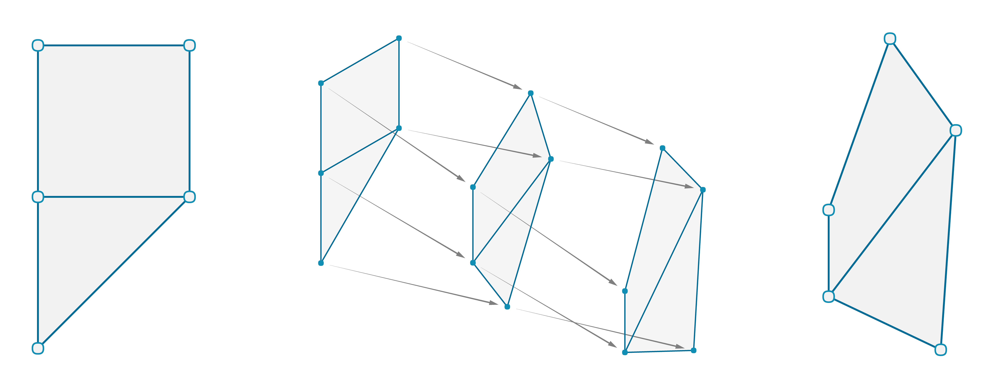
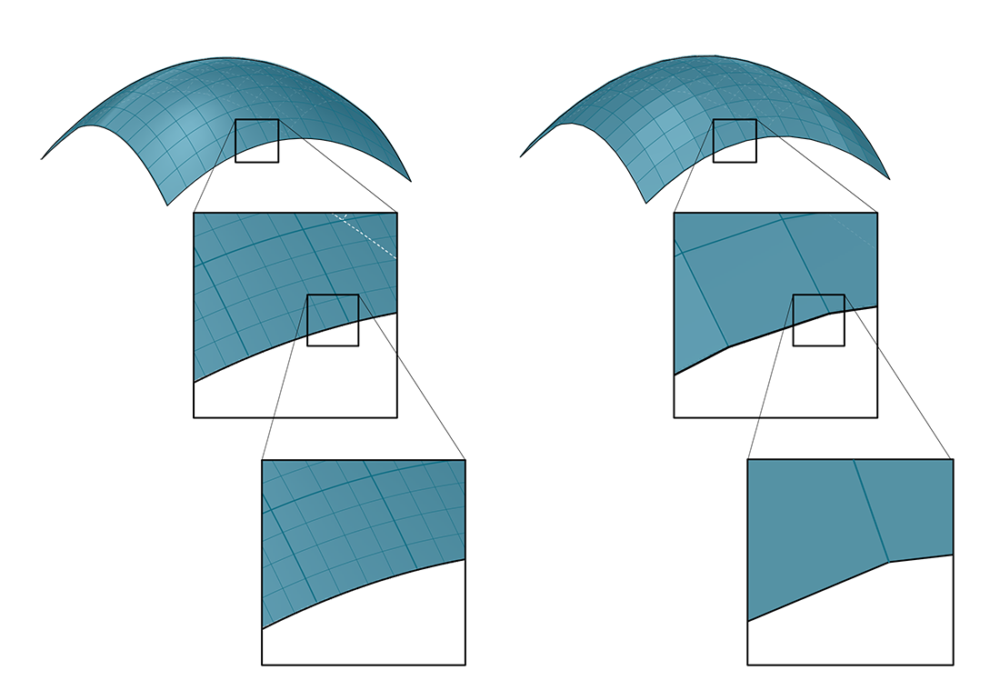

### 1.6.2 Понимание Топологии

#####В то время как вершины mesh содержат информацию о расположении, связи между вершинами дают геометрии mesh ее уникальную структуру и гибкость.

#### 1.6.2.1 Что такое Топология?

Любое введение в геометрию mesh будет неполным без базовых знаний о топологии. Все потому, что топология занимается взаимосвязями и характеристиками набора "вещей", а не самими "вещами", топология привлекается для огромной сферы применения одновременно материального и нематериального характера. В этом пособии нам интересно базовое применение касательно параметрического процесса работы, которые предоставляет нам возможность создавать и контролировать геометрию mesh.

В Grasshopper требуются два основных типа информации для определения mesh - это геометрия и наличие связей; другими словами, набор точек в rhino-пространстве (вершины) и набор соотвествующих точек-соединений (полигоны).

Без информации о наличии связей mesh неструктурированная и, потому, неопределенная. Введение в набор полигонов - это шаг (или прыжок), который, в конечном итоге, реализовывает mesh и создает ее характер с учетом непрерывности, конвергентности и связанности; эта структурная сеть называется *топологическим пространством*.

>Такой же набор вершин может иметь разную связанность и, как следствие, разную топологию.

**Гомеоморфность**

>Точки mesh могут быть перемещены без изменения информации о наличии связей. Новая mesh имеет такую же топологию, как и исходная.

Это возможно для двух различных форм mesh быть топологически идентичными. Все это означает, что они созданы из одинакового набора точек и что точки структурированы одним и тем же набором полигонов. Ранее, мы установили, что полигон mesh интересуется только индексами набора точек, но не их фактическим положением в rhino-пространстве. Таким образом, если единственная разница между двумя различными mesh формами в особом 3-х пространственном положении точек, которые используются для ее определения, тогда две mesh считаются "гомеоморфными" (или "топологически эквивалентными) и, поэтому, имеют одни и те же топологические характеристики.

>Пример гомеоморфности среди букв (заметьте, что некоторые из вышеуказанных гомеоморфных групп могут отличаться в зависимости от того, какой шрифт рассматривается)

>Топологически эквивалентные кружка и пончик
 
 
####1.6.2.2 Характеристики Mesh

**Ориентируемый**

Mesh считается *ориентируемой* если имеются хорошо определяемые стороны mesh. Простой пример неориентируемой mesh, когда смежные полигоны имеют нормали, указывающие в противоположных направлениях. Таке "перевернутые полигоны" могут вызвать проблемы в визуализации и рендере, а также при производстве или 3D-печати.

>1. Ориентируемая поверхность с нормалями полигона, указывающими в одном направлении.
2. Неориентируемая поверхность имеет смежные нормали, указывающие в разных направлениях.

**Открытая - Закрытая**

Часто необходимо знать является ли mesh *закрытой* объемное твердое тело, или открытой, 2-х пространственная поверхность. Разница может быть обязательной, особенно для возможностей производства. Вы не можете сделать 3D печать одиночной поверхности, у которой нет толщины, но вместо этого утолщает mesh, так что она становится твердым телом. Mesh геометрия твердого тела также требуется для операций с булевыми значениями (подробно в следующем разделе).

Компонент **Mesh Edges** может использоваться для определения этого фактора. Если ни одно из ребер mesh не имеет валентность 1 (если выход E1 - *отсутствующее значение*), тогда мы знаем, что все ребра являются Interior ребрами и у mesh нет внешнего граничного ребра и, таким образом, mesh закрытая.

С другой стороны, если имеется Naked ребра, тогда такие ребра должны располагаться на границе mesh и тогда mesh не закрытая.

>1. Закрытая mesh. Все ребра являются смежными с двумя полигонами.
2. Открытая mesh. Белые ребра являются смежными только для одного полигона.

**Однородная - Неоднородная**

Неоднородная геометрия, не что иное как геометрия, которая не может существовать в "реальном мире". Это необязательно делает ее "плохой геометрией", но об этом нужно знать из-за сложностей, которые она может представлять для инструментов и операций (например, рендер с эффектом преломления, симуляция флюидных потоков, булевые операции, 3d печать, и т.д.). Общие условия, которые приводят к неоднородной mesh, включают: самопересечение, naked ребра (из отверстий или внутренних полигонов), не объединенная топология и совпадающие/дублирующиеся полигоны. Mesh может также считаться *неоднородной* если она включает любые вершины, которые находятся на полигонах, которые не имеют общих ребер или имеют любые ребра с валентностью больше 2-х, создавая узел из, по крайней мере, 3-х полигонов

>1. Простая однородная mesh
2. Три полигона встречаются на одном ребре - неоднородная mesh, также известная как Т-узел
3. Два полигона встречаются только на одной вершине, но не имеют общего ребра - это неоднородная mesh

 
#### 1.6.2.3 Meshes и NURBS

Как геометрия mesh отличается от геометрии NURBS? В каких случаях вы захотите использовать одну вместо другой?

#####Параметризация
В предыдущей главе, мы видели, что поверхности NURBS определяются как последовательность кривых NURBS, направленных в двух направлениях. Эти направления отмечаются как U и V и позволяют параметризировать NURBS поверхность в соответствии с двух-пространственным диапазоном поверхности. Кривые, сами по себе, хранятся как уравнения в компьютере, позволяя рассчитать итоговую поверхность до какой угодно малой степени точности. Тем не менее, может быть сложно комбинировать множество NURBS поверхностей вместе. Объединяя две NURBS поверхности, мы получим полиповерхность, где различные секции геометрии будет иметь различные UV параметры и файлы кривых.

Mesh, с другой стороны, состоят из дискретного числа точно определенных вершин и полигонов. Связь вершин, обычно, не может быть определена простыми UV координатами и из-за того, что полигоны дискретны, степень точность встроена в mesh и может быть изменена только исправлением mesh и добавлением больше полигонов. Отсутствие UV координат, тем не менее, дает mesh гибкость, чтобы справиться с более сложной геометрией при помощи одной mesh, вместо использования полиповерхности, как при работе с NURBS.

>Примечание - хотя у mesh и нет скрытой UV параметризации, иногда полезно определить такую параметризацию, чтобы перенести текстуру или файл изображения на геометрию mesh для рендера. Некоторое моделирующее ПО, в таких случаях, принимает UV координаты вершины mesh за *характеристику * (как цвет вершины), которой можно управлять и изменять. Они, обычно, определены и не полностью определены самой mesh.

#####Локальное и Глобальное влияние

Еще одна важная разница - степень того, как локальное изменение в mesh или NURBS геометрии влияет на всю форму. Mesh геометрия полностью локальна. Перемещая одну вершину, мы повлияем только на тот полигон, который смежен с этой вершиной. В NURBS поверхностях степень влияния более сложная и зависит от степени поверхности, также как и веса и узлов контрольных точек. В общем, тем не менее, перемещение одной контрольной точки в NURBS поверхности создает более глобальные изменения в геометрии.

>1. NURBS поверхность - перемещение контрольной точки имеет глобальное влияние
2. Геометрия Mesh - перемещение вершины имеет локальное влияние

Полезной может быть одна аналогия - сравнить векторное изображения (состоящее из линий и кривых) с растровым изображением (состоящим из индивидуальных пикселей). Если вы приблизите векторное изображение, кривые останутся закрученными и чистыми, в то время как приближение растрового изображения показывает отдельные пиксели. В этом примере, NURBS поверхности можно сравнить с векторным изображением, а mesh ведет себя как растровое изображение.

>Приближение NURBS поверхности оставляет гладкую кривую, в то время как элементы mesh имеет фиксированное разрешение

Интересно отметить, что хоть NURBS поверхности хранятся как математические уравнения, их фактическая визуализация этих поверхностей требует использование mesh. Для компьютера это является невозможным отобразить непрерывное уравнение. Вместо этого, он должен разбить это уравнение на небольшие части, в результате чего, все процессы рендера или отображения должны конвертировать NURBS в mesh. В качестве аналога, представьте, что даже несмотря на то, что мы можем хранить уравнение в виде строчки на компьютере, чтобы отобразить эту линию, компьютер должен в какой-то момент конвертировать линию в последовательность дискретных пикселей на экране для отображения.

#### 1.6.2.4 За и Против Mesh

Когда мы задаем вопрос "Какие есть за и против моделирования с помощью mesh?", мы действительно спрашиваем "Какие есть за и против моделирования с помощью формы, которые определяются только набором вершин и соответствующей топологической структуры?" Посредством это метода выработки вопроса, становится легче увидеть, что "упрощенная" природа mesh является критичным аспектом, который сделает mesh либо подходящей либо неподходящей для моделирования в зависимости от контекста ее применения.

Mesh может подходить в ситуациях, где:

- Должен быть динамически обновляемый рендер формы, который меняется в самой форме, а не в связанности полигона
- Было бы достаточно дискретной аппроксимации кривой геометрии
- Геометрия низкого разрешения должна быть систематически сглажена (или артикулирована) с использованием вычислительных методов для получения модели высокого разрешения.
- Модель низкого разрешения должна одновременно поддерживать детали локальные, высокого разрешения

Mesh могут быть неподходящими в ситуациях, где:

- Кривизна и сглаженность должны быть представлены на высоком уровне точности
- True derivatives должны быть определены
- Геометрия должна быть конвертирована в изготавливаемое твердое тело
- Финальная форма должна быть легко изменяемой вручную

 

