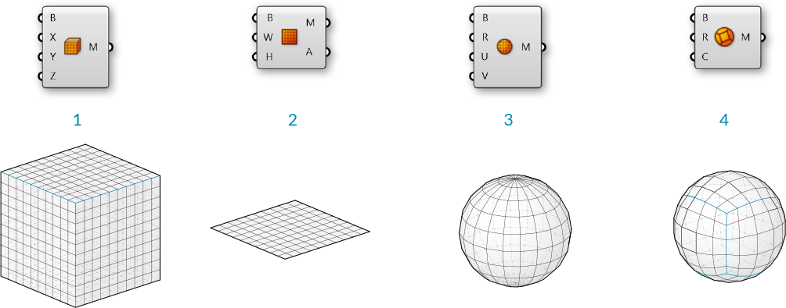
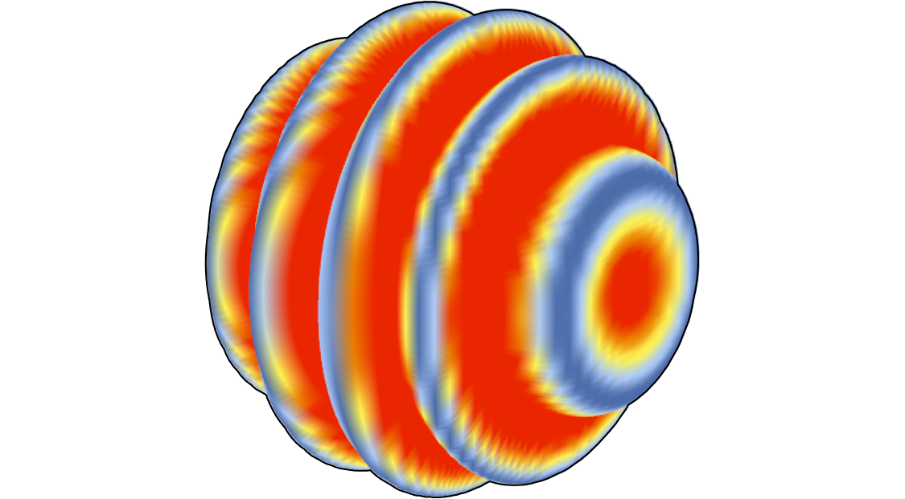
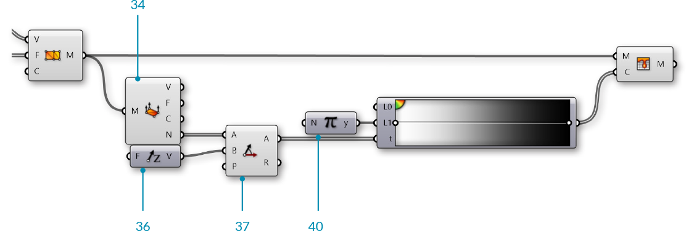

### 1.6.3 Создание Mesh

#####В последнем разделе мы рассмотрели основные структуры mesh. В этом разделе мы представим краткое введение в различные способы создания геометрии mesh.

Существует три основных способа создания геометрии mesh в Grasshopper:
1. Начать с mesh примитивы
2. Вручную создать mesh из полигонов и вершин
3. Конвертировать NURBS геометрию в mesh

####1.6.3.1 Примитивы

В Grasshopper есть несколько простых компонентов mesh примитивы:

>1. **Mesh Box** - - этот примитив нуждается в объекте Box (коробка) как вход, который предоставляет размер и положение, а также значения X, Y и Z, которые определяют на сколько полигонов разделить коробку. Шесть сторон Mesh Box *неспаенные*, что создает возможности для складок. (В следующем разделе мы расскажем подробнее о спаенных mesh)
2. **Mesh Plane** - этот примитив нуждается в входе Прямоугольник для определения размера и положения плоскости, а также значений W и H для определения числа полигонов.
3. **Mesh Sphere** - этот примитив нуждается в базовой плоскости для определения центра и ориентации сферы, радиус для размера и значения U и V для определения числа полигонов.
4. **Mesh Sphere Ex** - также известный как Квадрошар, этот примитив создает сферу, состоящую из шести участков, которые разделены в соответствии с входом C. Квадрошар - это топологический эквивалент куба, хотя он и геометрически сферический.

####1.6.3.2 Создание Mesh

Как мы видели в предыдущем разделе, компонент **Construct Mesh** может быть использован, чтобы непосредственно создать mesh из списка вершин и из списка полигонов (и из дополнительного списка цветов вершин). Создание целой mesh вручную может быть невероятно утомительным, поэтому этот компонент чаще используется с существующим списком полигонов и вершин, которые были извлечены используя компонент **Deconstruct Mesh** на существующую mesh.

####1.6.3.3 NURBS в Mesh

Возможно, самый распространенный способ создания сложной mesh - ее генерирование на основе геометрии NURBS. Индивидуальные поверхности NURBS могут быть конвертированы в mesh используя компонент **Mesh Surface** , он просто разделяет поверхность вдоль ее UV координат и создает четырехугольные полигоны. Этот компонент позволяет вводить число U и V подразделений для получаемой mesh.

Более комплексные полиповерхности могут быть конвертированы в одиночную mesh с помощью компонента **Mesh Brep** Этот компонент также имеет опциональный вход Settings (настройки), который может быть настроен используя один из встроенных компонентов Settings - *Speed* (скорость), *Quality* (качество), или *Custom* (пользовательский)  также можно кликнуть правой клавишей мыши по входу S и выбрать "Set Mesh Options". Для эффективного использования mesh, часто необходимо исправить эту mesh используя различные стратегии, такие как перестроение, сглаживание или подразделение. Некоторые из этих техник будут обсуждаться дальше в этом Пособии.

>1. **Mesh Surface** конвертирует NURBS поверхность в mesh
2. **Mesh Brep** может конвертировать полиповерхности и более сложные геометрии в одиночные mesh. Регулируя настройки можно создать больше или меньше полигонов, низкое или высокое разрешение mesh.

ПРИМЕЧАНИЕ: в целом, гораздо легче конвертировать NURBS геометрию в объект mesh, чем наоборот. И если UV координаты NURBS поверхности - несложные для конвертации в четырехугольные полигоны mesh, то обратное не всегда верно, так как mesh может содержать комбинацию треугольников и четырехугольников таким образом, что извлечь систему координат UV не просто.

####1.6.3.4 Упражнение

В этом упражнении мы используем основные Mesh примитивы, выполним изменение вершин и, затем, присвоим цвета, основываясь на нормали векторов для аппроксимации процесса рендера.


>Файлы упражнения, которые сопровождают этот раздел: [http://grasshopperprimer.com/appendix/A-2/1_gh-files.html](http://grasshopperprimer.com/appendix/A-2/1_gh-files.html)

>Файлы упражнения, которые сопровождают этот раздел: [Download](../../appendix/A-2/gh-files/1.6.3_creating meshes.gh)


||||
|--|--|--|
|01.| Запустите новое определение, набрав Ctrl+N (в Grasshopper)||
|02.| Зайдите в **Mesh/Primitive/Mesh Sphere** - перетащите компонент **Mesh Sphere** на холст||
|03.| Зайдите в **Params/Input/Number Slider** - вытащите компонент **Number Slider** на холст и установите следующие значения: <ul>Rounding: Integer Lower Limit:0 Upper Limit: 100 Value: 10</ul>||
|04.| Подключите слайдер **Number Slider** к входам U Count (U) и V Count (V) компонента **Mesh Sphere**|||

>Переместите слайдер и посмотрите как изменится разрешение сферы в видовом окне Rhino. Высокие значения ведут к более сглаженной сфере, но также производят большие массивы данных, которые могут требовать большее время обработки.

||||
|--|--|--|
|05.| Зайдите в **Mesh/Analysis/Deconstruct Mesh** - перетащите компонент **Deconstruct Mesh** на холст||
|06.| Соедините выход Mesh (M) компонента **Mesh Sphere** с входом Mesh (M) компонента **Deconstruct Mesh**||
|07.| Зайдите в **Transform/Euclidean/Move** - перетащите компонент **Move** на холст|
|08.| Соедините выход Vertices (V) компонента **Deconstruct Mesh** с входом Geometry (G) компонента **Move**||
|09.| Соедините выход Normals (N) компонента **Deconstruct Mesh** с входом Motion (T) компонента **Move**||
|10.| Зайдите в **Mesh/Analysis/Construct Mesh** - перетащите компонент **Construct Mesh** на холст||
|11.| Соедините выход Geometry (G) компонента **Move**с входом Vertices (V) компонента **Construct Mesh**||
|12.| Соедините выход Faces (F) компонента **Deconstruct Mesh** с входом Faces (F) компонента **Construct Mesh**|||

>Мы разобрали mesh на вершины, полигоны и нормали. Затем мы просто передвигаем каждую вершину в соответствии с ее нормаль вектором. Из-за того, что мы совсем не изменили топологию сферы, мы заново использовали список полигонов, чтобы реконструировать новую mesh. Нормаль векторы всегда имеют длину один, поэтому это привело к реконструированию новой сферы mesh с радиусом больше на один больше, чем исходная сфера. 

Далее, мы будем использовать функцию синуса для работы со сферой более сложным способом.

||||
|--|--|--|
|13.| Зайдите в **Vector/Point/Deconstruct** - перетащите компонент **Deconstruct** на холст||
|14.| Соедините выход Vertices (V) компонента **Deconstruct Mesh** с входом Point (P) компонента **Deconstruct**||
|15.| Зайдите в **Params/Input/Number Slider** - вытащите два слайдера **Number Slider** на холст||
|16.| Установите значения на первом слайдере **Number Slider**: <ul>Name: Amplitude (амплитуда)  Rounding: Float Lower Limit: 0 Upper Limit: 10</ul>||
|17.| Установите значения на втором слайдере **Number Slider**: <ul>Name: Frequency Rounding: Float Lower Limit: 0 Upper Limit: 5</ul>||
|18.| Зайдите в **Maths/Script/Expression** - перетащите компонент **Expression** на холст||
|19.| Приблизьте компонент **Expression**, пока не увидите опцию для добавления или удаления вводных переменных и кликните на '+', чтобы добавить переменную 'z'||
|20.| Кликните правой клавишей мыши по входу 'y' компонента **Expression** и измените текст на 'A'||
|21.| Кликните правой клавишей мыши по входу 'z' компонента **Expression** и измените текст на 'f'||
|22.| Дважды кликните по компоненту **Expression** для редактирования выражения и введите следующее: <ul>A\*sin(x\*f/π)</ul>||
|23.| Соедините выход X компонента **Deconstruct** с входом 'x' компонента **Expression**||
|24.| Соедините слайдер Amplitude **Number Slider** с входом A и слайдер Frequency **Number Slider** с входом 'f' компонента **Expression**||
|25.| Зайдите в **Maths/Operators/Multiplication** - перетащите компонент **Multiplication** на холст||
|26.| Соедините выход Normals (N) компонента **Deconstruct Mesh** с входом A компонента **Multiplication**||
|27.| Соедините выход Result (R) компонента **Expression** с входом B компонента **Multiplication**||
|28.| Соедините выход Result (R) компонента **Multiplication** с входом Motion (T) компонента **Move**|||

>Настройте слайдеры Amplitude и Frequency, чтобы посмотреть, как вновь созданные mesh изменятся.

||||
|--|--|--|
|29.| Зайдите в **Mesh/Primitive/Mesh Colours** - перетащите компонент **Mesh Colours** на холст||
|30.| Зайдите в **Params/Input/Gradient** - вытащите компонент **Gradient** на холст   <blockquote>Вы можете кликнуть правой клавишей мыши по компоненту Gradient и выберите "Presets", чтобы изменить цвет градиента. В этом примере мы использовали Красно-Желтый-Синий градиент</blockquote>||
|31.| Соедините выход Result (R) компонента **Expression** с входом Parameter (t) компонента **Gradient**||
|32.| Соедините выход компонента **Gradient** с входом Colours (C) компонента **Mesh Colours**||
|33.| Соедините выход Mesh (M) компонента **Construct Mesh** с входом Mesh (M) компонента **Mesh Colours**   <blockquote>В этом шаге, мы могли достигнуть такого же результата, если бы соединили Gradient прямо с входом Colours (C) компонента **Construct Mesh** </blockquote>|||

>Мы использовали результаты Expression, чтобы перемещать движения и вершин и цвет mesh, так что цветовой градиент, в этом случае, соответствует амплитуде движения вершин.

В конце этого упражнения, мы будем использовать направление нормалей относительно вектора источника света, чтобы симулировать основной процесс рендера mesh.

||||
|--|--|--|
|34.| **Mesh/Analysis/Deconstruct Mesh** - перетащите компонент **Deconstruct Mesh** на холст||
|35.| Соедините выход Mesh (M) компонента **Construct Mesh** с входом Mesh (M) компонента **Deconstruct Mesh**   <blockquote> В то время как топология исходной mesh изменилась, нормаль векторы будут отличаться, поэтому нам необходимо использовать новый компонент **Deconstruct Mesh**, чтобы найти новые нормали.</blockquote||
|36.| Зайдите в **Vector/Vector/Unit Z** - перетащите компонент **Unit X** на холст   <blockquote> Мы будем использовать это как направление источника света. Вы можете использовать другие векторы, или ссылаться на линию из Rhino, чтобы сделать ее более динамичной</blockquote>||
|37.| Зайдите в **Vector/Vector/Angle** - перетащите компонент **Angle** на холст||
|38.| Соедините выход Normals (N) компонента **Deconstruct Mesh** с входом A компонента **Angle**||
|39.| Соедините выход компонента **Unit Z** с входом B компонента **Angle**||
|40.| Зайдите в **Maths/Util/Pi** - перетащите компонент **Pi** на холст||
|41.| Соедините компонент **Pi** с входом Upper Limit (L1) компонента **Gradient**||
|42.| Соедините выход Angle (A) компонента **Angle** с входом Parameter (t) компонента **Gradient**|||

>Мы использовали черно-белую настройку для этого градиента. Это устанавливает цвет mesh в соответствии с углом между нормалью и источником света, с нормалями, которые направлены прямо на источник черного света, и с нормалями, которые направлены от источника белого цвета (чтобы быть более точными, вы можете развернуть градиент, настраивая ползунки). Реальный процесс рендера mesh намного более сложный, чем этот, конечно же, но это базовый процесс создания света и тени на отрендеренном объекте.

---

