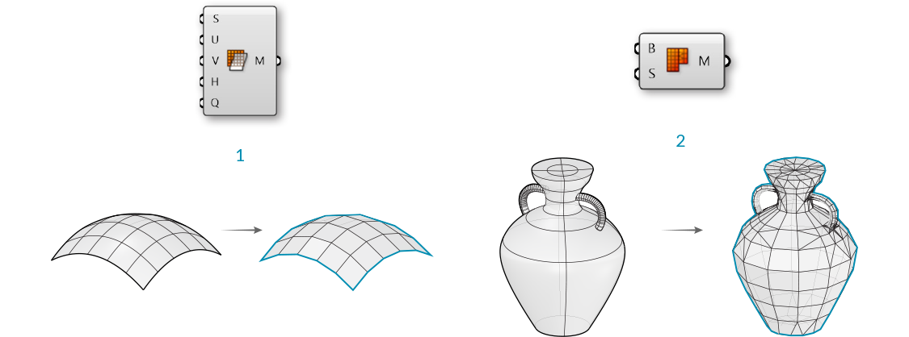
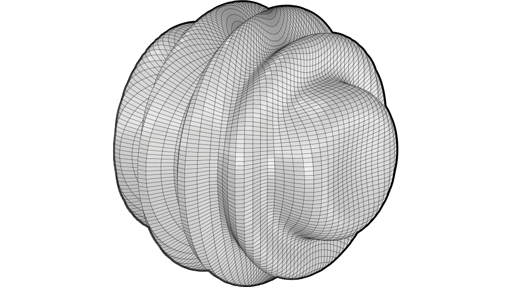
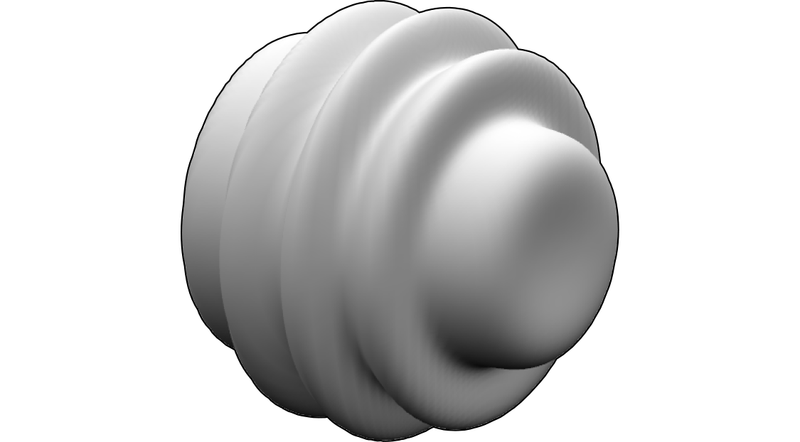

### 1.6.3 Создание Meshes

#####В последнем разделе мы рассмотрели основные структуры mesh. В этом разделе мы представим краткое введение в различные способы создания геометрии mesh.

Существует три основных способа создания геометрии mesh в Grasshopper:
1. Начать с mesh примитивы
2. Вручную создать mesh из полигонов и вершин
3. Конвертировать NURBS геометрию в mesh

####1.6.3.1 Примитивы

В Grasshopper есть несколько простых компонентов mesh примитивы:

>1. **Mesh Box** - - этот примитив нуждается в объекте Box (коробка) как вход, который предоставляет размер и положение, а также значения X, Y и Z, которые определяют на сколько полигонов разделить коробку. Шесть сторон Mesh Box *неспаенные*, что создает возможности для складок. (В следующем разделе мы расскажем подробнее о спаенных mesh)
2. **Mesh Plane** - этот примитив нуждается в входе Прямоугольник для определения размера и положения плоскости, а также значений W и H для определения числа полигонов.
3. **Mesh Sphere** - этот примитив нуждается в базовой плоскости для определения центра и ориентации сферы, радиус для размера и значения U и V для определения числа полигонов.
4. **Mesh Sphere Ex** - также известный как Квадрошар, этот примитив создает сферу, состоящую из шести участков, которые разделены в соответствии с входом C. Квадрошар - это топологический эквивалент куба, хотя он и геометрически сферический.

####1.6.3.2 Создание Mesh

Как мы видели в предыдущем разделе, компонент **Construct Mesh** может быть использован, чтобы непосредственно создать mesh из списка вершин и из списка полигонов (и из дополнительного списка цветов вершин). Создание целой mesh вручную может быть невероятно утомительным, поэтому этот компонент чаще используется с существующим списком полигонов и вершин, которые были извлечены используя компонент **Deconstruct Mesh** на существующую mesh.

####1.6.3.3 NURBS в Mesh

Возможно, самый распространенный способ создания сложной mesh - ее генерирование на основе геометрии NURBS. Индивидуальные поверхности NURBS могут быть конвертированы в mesh используя компонент **Mesh Surface** , он просто разделяет поверхность вдоль ее UV координат и создает четырехугольные полигоны. Этот компонент позволяет вводить число U и V подразделений для получаемой mesh.

Более комплексные полиповерхности могут быть конвертированы в одиночную mesh с помощью компонента **Mesh Brep** Этот компонент также имеет опциональный вход Settings (настройки), который может быть настроен используя один из встроенных компонентов Settings - *Speed* (скорость), *Quality* (качество), или *Custom* (пользовательский)  также можно кликнуть правой клавишей мыши по входу S и выбрать "Set Mesh Options". Для эффективного использования mesh, часто необходимо исправить эту mesh используя различные стратегии, такие как перестроение, сглаживание или подразделение. Некоторые из этих техник будут обсуждаться дальше в этом Пособии.

>1. **Mesh Surface** конвертирует NURBS поверхность в mesh
2. **Mesh Brep** может конвертировать полиповерхности и более сложные геометрии в одиночные mesh. Регулируя настройки можно создать больше или меньше полигонов, низкое или высокое разрешение mesh.

ПРИМЕЧАНИЕ: в целом, гораздо легче конвертировать NURBS геометрию в объект mesh, чем наоборот. И если UV координаты NURBS поверхности - несложные для конвертации в четырехугольные полигоны mesh, то обратное не всегда верно, так как mesh может содержать комбинацию треугольников и четырехугольников таким образом, что извлечь систему координат UV не просто.

####1.6.3.4 Упражнение

В этом упражнении мы используем основные Mesh примитивы, выполним изменение вершин и, затем, присвоим цвета, основываясь на нормали векторов для аппроксимации процесса рендера.


>Файлы упражнения, которые сопровождают этот раздел: [http://grasshopperprimer.com/appendix/A-2/1_gh-files.html](http://grasshopperprimer.com/appendix/A-2/1_gh-files.html)

>Файлы упражнения, которые сопровождают этот раздел: [Download](../../appendix/A-2/gh-files/1.6.3_creating meshes.gh)


||||
|--|--|--|
|01.| Запустите новое определение, набрав Ctrl+N (в Grasshopper)||
|02.| Зайдите в **Mesh/Primitive/Mesh Sphere** - перетащите компонент **Mesh Sphere** на холст||
|03.| Зайдите в **Params/Input/Number Slider** - вытащите компонент **Number Slider** на холст и установите следующие значения: <ul>Rounding: Integer Lower Limit:0 Upper Limit: 100 Value: 10</ul>||
|04.| Подключите слайдер **Number Slider** к входам U Count (U) и V Count (V) компонента **Mesh Sphere**|||

>Переместите слайдер и посмотрите как изменится разрешение сферы в видовом окне Rhino. Высокие значения ведут к более сглаженной сфере, но также производят большие массивы данных, которые могут требовать большее время обработки.

||||
|--|--|--|
|05.| Зайдите в **Mesh/Analysis/Deconstruct Mesh** - перетащите компонент **Deconstruct Mesh** на холст||
|06.| Соедините выход Mesh (M) компонента **Mesh Sphere** с входом Mesh (M) компонента **Deconstruct Mesh**||
|07.| Зайдите в **Transform/Euclidean/Move** - перетащите компонент **Move** на холст|
|08.| Соедините выход Vertices (V) компонента **Deconstruct Mesh** с входом Geometry (G) компонента **Move**||
|09.| Соедините выход Normals (N) компонента **Deconstruct Mesh** с входом Motion (T) компонента **Move**||
|10.| Зайдите в **Mesh/Analysis/Construct Mesh** - перетащите компонент **Construct Mesh** на холст||
|11.| Соедините выход Geometry (G) компонента **Move**с входом Vertices (V) компонента **Construct Mesh**||
|12.| Соедините выход Faces (F) компонента **Deconstruct Mesh** с входом Faces (F) компонента **Construct Mesh**|||

>We deconstructed the mesh to get its vertices, faces, and normals. We then simply moved each vertex according to its normal vector. Because we did not change the topology of the sphere at all, we re-used the list of faces to re-construct the new mesh. Normal vectors always have a length of one, so this ended up reconstructing a new mesh sphere with a radius of one more than the original sphere. 

Next, we will use a sine function to manipulate the sphere in a slightly more complicated way.

||||
|--|--|--|
|13.| **Vector/Point/Deconstruct** - Drag and drop a **Deconstruct** component onto the canvas||
|14.| Connect the Vertices (V) output of the **Deconstruct Mesh** component to the Point (P) input of the **Deconstruct** component||
|15.| **Params/Input/Number Slider** - Drag and drop two **Number Slider** components onto the canvas||
|16.| Set the values of the frist **Number Slider** to: <ul>Name: Amplitude  Rounding: Float Lower Limit: 0 Upper Limit: 10</ul>||
|17.| Set the values of the second **Number Slider** to: <ul>Name: Frequency Rounding: Float Lower Limit: 0 Upper Limit: 5</ul>||
|18.| **Maths/Script/Expression** - Drag and drop an **Expression** component onto the canvas||
|19.| Zoom in to the **Expression** component until you see the options for adding or removing input variables and click on a '+' to add a 'z' variable||
|20.| Right click the 'y' input of the **Expression** component and change the text to 'A'||
|21.| Right click the 'z' input of the **Expression** component and change the text to 'f'||
|22.| Double click the **Expression** component to edit the expression, and enter the following: <ul>A\*sin(x\*f/π)</ul>||
|23.| Connect the X output of the **Deconstruct** component to the 'x' input of the **Expression** component||
|24.| Connect the Amplitude **Number Slider** to the A input, and the Frequency **Number Slider** to the 'f' input of the **Expression** component||
|25.| **Maths/Operators/Multiplication** - Drag and drop a **Multiplication** component onto the canvas||
|26.| Connect the Normals (N) output of the **Deconstruct Mesh** component to the A input of the **Multiplication** component||
|27.| Connect the Result (R) output of the **Expression** component to the the B input of the **Multiplication** component||
|28.| Connect the Result (R) output of the **Multiplication** component to the Motion (T) input of the **Move** component|||

>Adjust the Amplitude and Frequency number sliders to see how the newly constructed mesh changes.

||||
|--|--|--|
|29.| **Mesh/Primitive/Mesh Colours** - Drag and drop a **Mesh Colours** component onto the canvas||
|30.| **Params/Input/Gradient** - Drag and drop a **Gradient** component onto the canvas   <blockquote>You can right-click the gradient component and select "Presets" to change the color gradient. In this example, we used the Red-Yellow-Blue gradient</blockquote>||
|31.| Connect the Result (R) output of the **Expression** component to the Parameter (t) input of the **Gradient** component||
|32.| Connect the output of the **Gradient** component to the Colours (C) input of the **Mesh Colours** component||
|33.| Connect the Mesh (M) output of the **Construct Mesh** component to the Mesh (M) input of the **Mesh Colours** component   <blockquote>In this step, we could achieve the same result by connecting the gradient directly to the Colours (C) input of the **Construct Mesh** component</blockquote>|||

>We used the Expression results to drive both the movement of the vertices and the color of the mesh, so the color gradient in this case corresponds to the magnitude of the movement of the vertices. 

For the final portion of the exercise, we will instead use the direction of the normals relative to a 'light source' vector to simulate the basic process of rendering a mesh.

||||
|--|--|--|
|34.| **Mesh/Analysis/Deconstruct Mesh** - Drag and drop a **Deconstruct Mesh** component onto the canvas||
|35.| Connect the Mesh (M) output of the **Construct Mesh** component to the Mesh (M) input of the **Deconstruct Mesh** component   <blockquote> While the topology of the original mesh has not changed, the normal vectors will be different, so we need to use a new **Deconstruct Mesh** to find the new normals.</blockquote||
|36.| **Vector/Vector/Unit Z** - Drag and drop a **Unit X** component onto the canvas   <blockquote> We will use this as the direction of a light source. You can use other vectors, or reference a line from Rhino to make this more dynamic</blockquote>||
|37.| **Vector/Vector/Angle** - Drag and drop an **Angle** component onto the canvas||
|38.| Connect the Normals (N) output of the **Deconstruct Mesh** component to the A input of the **Angle** component||
|39.| Connect the output of the **Unit Z** component to the B input of the **Angle** component||
|40.| **Maths/Util/Pi** - Drag and drop a **Pi** component onto the canvas||
|41.| Connect the **Pi** component to the Upper Limit (L1) input of the **Gradient** component||
|42.| Connect the Angle (A) output of the **Angle** component to the Parameter (t) input of the **Gradient** component|||

>We used the white-to-black preset for our gradient. This sets the mesh color according to the angle between the normal and the light source, with normals that are directly facing the light source to black and the normals facing away from the source to white (To be a little more accurate, you can reverse the gradient by adjusting the handles). The actual process of rendering a mesh is much more complicated than this, obviously, but this is the basic process of creating light and shadow on a rendered object.

---

