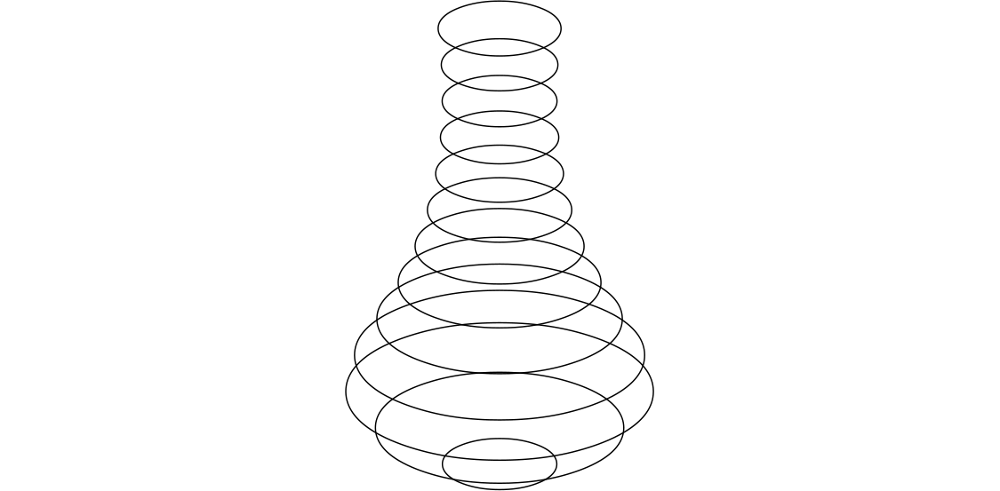
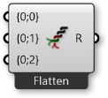
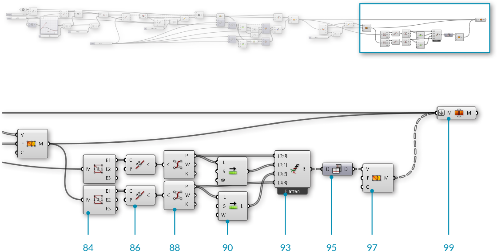

### 1.6.6 Работа с геометрией Mesh

#####В этом разделе мы будем работать над производством твердого тела mesh. К концу этого упражнения у нас будет динамическое определение для производства индивидуальных ваз, которые можно напечатать на 3D принтере.


>Файлы упражнения, которые сопровождают этот раздел: [http://grasshopperprimer.com/appendix/A-2/1_gh-files.html](http://grasshopperprimer.com/appendix/A-2/1_gh-files.html)

>Файлы упражнения, которые сопровождают этот раздел: [Download](../../appendix/A-2/gh-files/1.6.6_working with meshes.gh)


Так как это определение несколько больше, чем предыдущие упражнения в этом пособии, мы сначала разберем базовые этапы, через которые мы пройдем:

>1. Создадим последовательность кругов в качестве базового цилиндра
2. Используем компонент Graph Mapper, чтобы определить контур нашей вазы
3. Создадим топологию полигонов mesh, чтобы  произвести единую поверхность mesh
4. Закроем низ mesh
5. Введем закручивание по вертикали для создания более динамической формы
6. Добавим складчатые ребра для текстуры
7. Сместим поверхность mesh, чтобы придать вазе толщину
8. Закроем верхний зазор между двумя поверхностями, чтобы создать закрытое твердое тело

||||
|--|--|--|
|01.| Запустите новое определение, набрав Ctrl+N (в Grasshopper)||
|02.| Зайдите в **Params/Geometry/Point** - вытащите контейнер **Point** на холст||
|03.| Кликните правой клавишей мыши в Rhino по компоненту **Point** и выберите Set one Point, чтобы привязать точку. Она будет служить исходной точкой нашей вазы.   <blockquote>Вы можете создать точку вручную в Grasshopper, дважды кликнув по холсту, чтобы вызвать окно поиска, затем ввести координаты точки, разделенные запятыми, вот так: '0,0,0' (без кавычек) </blockquote>||
|04.| Зайдите в **Params/Input/Number Slider** - вытащите компонент **Number Slider** на холст и установите следующие значения: <ul>Name: Length Lower Limit: 1 Upper Limit: 10</ul>||
|05.| Зайдите в **Curve/Primitive/Line SDL** - вытащите компонент **Line SDL** на холст||
|06.| Соедините компонент **Point** с входом Start (S) компонента **Line SDL** и соедините слайдер **Number Slider** с входом Length (L).   <blockquote>Значение Direction (D) компонента **Line SDL**, по умолчанию, Unit Z вектор, который мы будем использовать в этом упражнении.</blockquote>||
|07.| Зайдите в **Params/Input/Number Slider** - вытащите компонент **Number Slider** на холст и установите следующие значения: <ul>Name: V Count Rounding: Integer Lower Limit: 1 Upper Limit: 100</ul>||
|08.| Зайдите в **Curve/Division/Divide Curve** - вытащите компонент **Divide Curve** на холст||
|09.| Соедините выход Line (L) компонента **Line SDL** с входом Curve (C) компонента **Divide Curve**||
|10.| Подключите слайдер **V Count** к входу Count (N) компонента **Divide Curve**||
|11.| Зайдите в **Curve/Primitive/Circle CNR** - вытащите компонент **Circle CNR** на холст||
|12.| Соедините выход Points (P) компонента **Divide Curve** с входом Center (C) компонента **Circle CNR**|||

>Теперь у нас есть последовательность вертикально расположенных кругов. Мы будем далее использовать их для создания контура нашей вазы.

Далее, мы будем использовать Graph Mapper, чтобы контролировать радиус кругов.

||||
|--|--|--|
|13.| Зайдите в **Sets/Sequence/Range** - вытащите компонент **Range** на холст||
|14.| Подключите слайдер **V Count** к входу Steps (N) компонента **Range**||
|15.| Зайдите в **Params/Input/Graph Mapper** - вытащите компонент **Graph Mapper** на холст||
|16.| Кликните правой клавишей мыши по **Graph Mapper**, кликните по 'Graph Types' в меню и выберите 'Bezier'||
|17.| Зайдите в **Params/Input/Number Slider** - вытащите компонент **Number Slider** на холст и установите следующие значения: <ul>Name: Width Lower Limit: 0 Upper Limit: 10</ul>||
|18.| Зайдите в **Maths/Operators/Multiplication** - перетащите компонент **Multiplication** на холст||
|19.| Соедините **Graph Mapper** и слайдер **Width** с входами A и B компонента **Multiplication**||
|20.| Соедините выход Result (R) компонента **Multiplication** с входом Radius (R) компонента **Circle CNR**|||

>Используйте ползунки на **Graph Mapper** для настройки контура кругов. 

>ПРИМЕЧАНИЕ: Важно убедиться, что начальная точка кривой Безье (Bezier curve) на **Graph Mapper**не равна нулю. Для этого мы поднимаем начальную точку до числа больше нуля и, таким образом, создаем плоскую основу для нашей вазы.

Теперь у нас есть контур для нашей вазы. Далее, мы построим поверхность mesh. Это потребует создания вершин mesh и определения полигонов mesh в соответствии с индексами тех вершин.

||||
|--|--|--|
|21.| Зайдите в **Params/Input/Number Slider** - вытащите компонент **Number Slider** на холст и установите следующие значения: <ul>Name: U Count Rounding: Even Lower Limit: 2 Upper Limit: 100</ul>||
|22.| Зайдите в **Curve/Division/Divide Curve** - вытащите компонент **Divide Curve** на холст||
|23.| Соедините выход Circle (C) компонента **Circle CNR** с входом Curve (C) компонента **Divide Curve**, соедините слайдер **U Count** с входом Count (N)   <blockquote>Выход Points(P) этого компонента - вершины, которые мы будем использовать для нашей mesh</blockquote>||
|24.| Зайдите в **Sets/Sequence/Series** - вытащите два компонента **Series** на холст||
|25.| Соедините слайдер **U Count** с входом Step (N) первого компонента **Series**, и соедините слайдер **V Count** с входом Count (C) того же самого компонента **Series**||
|26.| Соедините выход Series (S) первого компонента **Series** с входом Start (S) второго компонента **Series**, и соедините слайдер **U Count** с входом Count (C)||
|27.| Зайдите в **Sets/List/Shift List** - вытащите компонент **Shift List** на холст||
|28.| Соедините выход второго компонента **Series** с входом List (L) компонента **Shift List**||
|29.| Зайдите в **Maths/Operators/Addition** - перетащите два компонента **Addition** на холст||
|30.| Соедините выход второго компонента **Series** и слайдер **U Count** с входами A и B первого компонента **Addition**||
|31.| Соедините выход компонента **Shift List** и слайдер **U Count** с входами A и B второго компонента **Addition**||
|32.| **Mesh/Primitive/Mesh Quad** - перетащите компонент **Mesh Quad** на холст||
|33.| Соедините следующее с входами компонента **Mesh Quad**: <ul>A - Второй компонент **Series** B - **Shift List**   C - Первый компонент **Addition**  D - Второй компонент **Addition** </ul> <blockquote>Мы только что создали начальную топологию нашей mesh. Эти полигоны будут комбинироваться с вершинами. Порядок этих соединений критичен, поэтому далее дважды проверяйте все соединения в этой точке!</blockquote>||
|34.| Зайдите в **Sets/Tree/Flatten** - вытащите компонент **Flatten Tree** на холст||
|35.| Соедините выход Points (P) компонента **Divide Curve** с входом Tree (T) компонента **Flatten Tree**||
|36.| **Mesh/Primitive/Construct Mesh** - перетащите компонент **Construct Mesh** на холст||
|37.| Соедините выход Tree (T) компонента **Flatten Tree** с входом Vertices (V) компонента **Construct Mesh**||
|38.| Соедините выход Face (F) компонента **Mesh Quad** с входом Faces (F) компонента **Construct Mesh**. Кликните правой клавишей мыши по входу F (Faces) и выберите 'Flatten'|||

>Теперь у нас есть поверхность mesh для нашей вазы.

 

Next we will close the bottom of the vase. To do this, we will add the original origin point to our list of vertices, and then construct triangle mesh faces from the bottom edge to that point.

||||
|--|--|--|
|39.| **Sets/Sequence/Series** - Drag and drop a **Series** component onto the canvas||
|40.| Connect the **U Count** number slider to the Count (C) input of the **Series** component||
|41.| **Sets/List/List Length** - Drag and drop a **List Length** component onto the canvas||
|42.| Connect the Tree (T) output of the **Flatten Tree** component to the List (L) input of the **List Length** component   <blockquote>This will be the index of the origin point after we add it to the existing list of vertices.</blockquote>||
|43.| **Sets/List/Shift List** - Drag and drop a **Shift List** component onto the canvas||
|44.| **Mesh/Primitive/Mesh Triangle** - Drag and drop a **Mesh Triangle** component onto the canvas||
|45.| Connect the following to the inputs of the **Mesh Triangle** component: <ul>A - Newest **Series** component B - **List Length** C - **Shift List**</ul>||
|46.| **Sets/Tree/Merge** - Drag and drop two **Merge** components onto the canvas||
|47.| Connect the Tree (T) output of the **Flatten Tree** component to the D1 input, and connect the initial **Point** component to the D2 input of the first **Merge** component||
|48.| Connect the Faces (F) of the **Mesh Quad** component to the D1 input, and connect the **Mesh Triangle** output to the D2 input of the second **Merge** component||
|49.| Connect the first **Merge** component to the Vertices (V) input of the **Construct Mesh** component, and connect the second **Merge** component to the Faces (F) input of the **Construct Mesh** component.|||

>We have capped the bottom of the vase with triangle mesh faces.

 

We will now add some detailing to the vase. We will start by adding a curve to the vertical direction by adjusting the *seam* of the original circles

||||
|--|--|--|
|50.| **Curve/Util/Seam** - Drag and drop a **Seam** component onto the canvas||
|51.| Connect the Circle (C) output of the **Circle CNR** component to the Curve (C) input of the **Seam** component||
|52.| Right click the Curve (C) input of the **Seam** component and select 'Reparameterize'||
|53.| **Params/Input/Number Slider** - Drag and drop a **Number Slider** component onto the canvas. We will use the default settings for this slider||
|54.| **Maths/Operator/Multiplication** - Drag and drop a **Multiplication** component onto the canvas.||
|55.| Connect the output from the **Graph Mapper** to the A input, and the newest **Number Slider** to the B input of the **Multiplication** component||
|56.| Connect the Result (R) of the **Multiplication** component to the Parameter (t) input of the **Seam** component|||

>The curvature is achieved by changing the *seam* position of the initial circles, and uses the same Graph Mapper as the vase profile.

 

Next we will add some vertical ridges to the vase.

||||
|--|--|--|
|57.| **Sets/List/Dispatch** - Drag and drop a **Dispatch** component onto the canvas||
|58.| Connect the Point (P) output of the second **Divide Curve** component to the List (L) input of the **Dispatch** component   <blockquote>We are using the default Pattern (P) input of the **Dispatch** component to separate the points into two lists with alternating points</blockquote>||
|59.| **Vector/Vector/Vector 2Pt** - Drag and drop a **Vector 2Pt** component onto the canvas||
|60.| Connect the B output of the **Dispatch** component to the A input of the **Vector 2Pt** component||
|61.| Connect the Points (P) of the *first* **Divide Curve** component to the B input of the **Vector 2Pt** component||
|62.| Right-click the B input of the **Vector 2Pt** component and select 'Graft', and right-click the Unitize (U) input, go to 'Set Boolean' and select 'True'   <blockquote>This creates a unit vector for each point that points towards the center of the circle</blockquote>||
|63.| **Params/Input/Number Slider** - Drag and drop a **Number Slider** component onto the canvas. We will use the default settings||
|64.| **Maths/Operator/Multiplication** - Drag and drop a **Multiplication** component onto the canvas||
|65.| Connect the Vector (V) output of the **Vector 2Pt** component to the A input, and connect the **Number Slider** to the B input of the **Multiplication** component||
|66.| **Transform/Euclidean/Move** - Drag and drop a **Move** component onto the canvas||
|67.| Connect the B output of the **Dispatch** component to the Geometry (G) input of the **Move** component||
|68.| Connect the Result (R) output of the **Multiplication** component to the Motion (T) input of the **Move** component||
|69.| **Sets/List/Weave** - Drag and drop a **Weave** component onto the canvas||
|70.| Connect the A output of the **Dispatch** component to the 0 input of the **Weave** component||
|71.| Connect the Geometry (G) output of the **Move** component to the 1 input of the **Weave** component||
|72.| Connect the Weave (W) output of the **Weave** component to the Tree (T) input of the **Flatten Tree** component|||

>Remember to go back and adjust your sliders and graph mapper to see how the model changes, and to make sure everything still works. This is known as 'flexing' the model, and should be done frequently to check for mistakes in the definition.

We now have a single surface for our vase. If we wanted to print this vase using a 3D printer, we need it to be a closed solid. We will create a solid by offsetting the current mesh, then combining the original mesh and the offset mesh.

||||
|--|--|--|
|73.| **Mesh/Analysis/Deconstruct Mesh** - Drag and drop a **Deconstruct Mesh** component onto the canvas||
|74.| Connect the Mesh (M) output of the **Construct Mesh** component to the Mesh (M) input of the **Deconstruct Mesh** component||
|75.| **Params/Input/Number Slider** - Drag and drop a **Number Slider** component onto the canvas. We will use the default settings||
|76.| **Maths/Operator/Multiplication** - Drag and drop a **Multiplication** component onto the canvas||
|77.| Connect the Normals (N) output of the **Deconstruct Mesh** component to the A input, and connect the **Number Slider** to the B input of the **Multiplication** component||
|78.| **Transform/Euclidean/Move** - Drag and drop a **Move** component onto the canvas||
|79.| Connect the Vertices (V) output of the **Deconstruct Mesh** component to Geometry (G) input of the **Move** component||
|80.| Connect the Result (R) output of the **Multiplication** component to the Motion (T) input of the **Move** component||
|81.| **Mesh/Primitive/Construct Mesh** Drag and drop a **Construct Mesh** component onto the canvas||
|82.| Connect the Geometry (G) output of the **Move** component to the Vertices (V) input of the **Construct Mesh** component||
|83.| Connect the Faces (F) output of the **Deconstruct Mesh** component to the Face (F) input of the **Construct Mesh** component|||

>By offseting the mesh according to the vertex normals, we now have an 'inside' and an 'outside' mesh, but we still have a gap at the top between the two mesh geometries

The final step will be to create a closed mesh by creating a new mesh geometry to close the gap and then joining the meshes together.

||||
|--|--|--|
|84.| **Mesh/Analysis/Mesh Edges** - Drag and drop a **Mesh Edges** component onto the canvas||
|85.| Connect the Mesh (M) output of the first **Construct Mesh** component to the Mesh (M) input of the **Mesh Edges** component||
|86.| **Curve/Util/Join Curves** - Drag and drop a **Join Curves** component onto the canvas||
|87.| Connect the Naked Edges (E1) output of the **Mesh Edges** component to the Curves (C) input of the **Join Curves** component||
|88.| **Curve/Analysis/Control Points** - Drag and drop a **Control Points** component onto the canvas||
|89.| Connect the Curves (C) output of the **Join Curves** component to the Curve (C) input of the **Control Points** component   <blockquote>By joining the curves and then extrating the control points, we ensure that the order of the points is consistent along the rim of the vase, which is important for making the resulting mesh orientable and manifold</blockquote>||
|90.| **Sets/List/Shift List** - Drag and drop a **Shift List** component onto the canvas||
|91.| Connect the Points (P) output of the **Control Points** component to the List (L) input of the **Shift List** component||
|92.| Repeat steps 84 through 91 for the second **Construct Mesh** component||
|93.| **Sets/Tree/Entwine** - Drag and drop an **Entwine** component onto the canvas||
|94.| Zoom in to the **Entwine** component to show the option to add an extra input. We will need four inputs. Connect them in the following way: <ul>{0;0} - Points (P) from first **Control Points** component {0;1} - output from first **Shift List**  {0;2} - output from second **Shift List** {0;3} - Points (P) from second **Control Points** component</ul>||
|95.| **Sets/Tree/Flip Matrix** - Drag and drop a **Flip Matrix** component onto the canvas||
|96.| Connect the Result (R) from the **Entwine** component to the Data (D) input of the **Flip Matrix** component||
|97.| **Mesh/Primitive/Construct Mesh** - Drag and drop a **Construct Mesh** component onto the canvas||
|98.| Connect the Data (D) outut of the **Flip Matrix** component to the Vertices (V) input of the **Construct Mesh** component||
|99.| **Mesh/Util/Mesh Join** - Drag and drop a **Mesh Join** component onto the canvas||
|100.| Connect all three **Construct Mesh** components to the **Mesh Join** component by holding down the Shift key while connecting the wires (or use a **Merge** component). Right-click the Mesh (M) input of the **Mesh Join** component and select 'Flatten'|||

---

