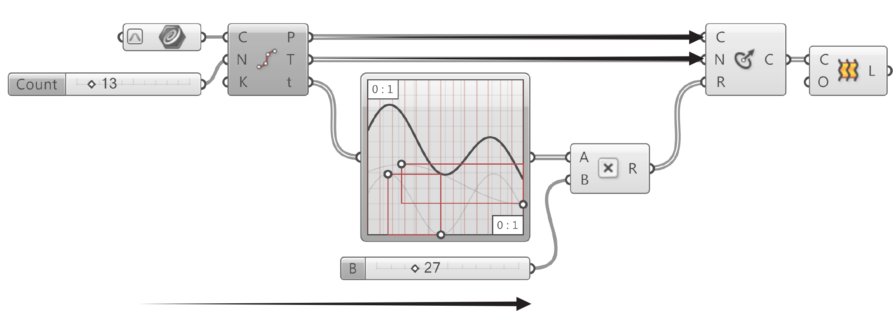

## Grasshopper概述

#####Grasshopper是一款由Robert McNeel & Associates公司的David Rutten开发的可视化编程工具。作为Rhino3D的插件，Grasshopper与这一强大而全面，并被建筑、工程以及产品设计等诸多领域的创意工作者广泛使用的建模环境整合在一起。配合使用Grasshopper与Rhino，使我们能够以参数化的方式精确地控制模型，探索生成设计的工作流程，同时也为我们提供了一个创建高级程序逻辑的平台——这一切都可以在一个直观的图形界面中实现。

Grasshopper的起源可以追溯到Rhino3d第4版的“历史记录”按钮。这一自带功能可在后台记录下用户的建模过程。如果你在“历史记录”开启的同时放样四条曲线，随后编辑其中一条曲线的控制点，曲面就会相应地更新。2008年，David提出了这样的问题：“如果可以更加精确地控制这个历史将会怎样？”于是，Grasshopper的前身——Explicit History诞生了。它让历史树能够被具体地编辑，使得用户可以创建具有逻辑关系的序列，从而不仅仅局限于Rhino3D的自带功能。六年后，Grasshopper已经成为了一款强大的可通过外部开发的附加套件进行拓展的可视化编程工具。此外，它还从根本上改变了多个行业的从业人员的工作流程，并打造了一个十分活跃的全球用户社区。

本教程侧重“基础”，提供投入到Grasshopper常规使用中所需的核心知识，以及针对具体的创意实践的进阶指南。在投入到后面的描述、图解和实例之前，让我们先来讨论一下什么是可视化编程，Grasshopper的基本界面和术语，及其视口反馈与用户体验方面的“实时”特征。

可视化编程一种计算机编程范式，在该范式下，用户通过图形而非文本来操纵逻辑元件。一些著名的文本程序语言，例如C#、Visual Basic、Processing——以及与Rhino更为紧密的——Python和Rhinoscript，要求我们按照各语言特有的语法来书写代码。而可视化编程允许我们将函数模块连接成一套行为序列，而唯一所需的“语法”就是，模块的输入端接收到正确的数据类型，并根据想要得到的结果完美地组织数据——参见《数据流匹配》和《用数据树做设计》的章节。可视化编程的这一特征，降低了学习新的语言——哪怕是一种口语——时会遇到的门槛，侧重于可视化界面，这将Grasshopper定位在设计师更熟悉的领域之中。

>这张图片展示了在Python和Grasshopper中画一个正弦曲线的过程。

使用Grasshopper并发挥其可视化编程优势，我们需要先从Grasshopper3D.com网站下载并安装该程序。安装之后，我们可以在Rhino命令行中输入“Grasshopper”来运行插件。在新的Rhino会话中首次运行Grasshopper时，我们会看到Grasshopper的加载弹窗，随后Grasshopper的编辑窗口就会被打开。现在我们就可以将被称为“运算器”的函数模块添加到“画布”上，并用“连线”把他们连接在一起，并将整个“定义”保存为.ghx文件格式。

>一个Grasshopper定义，由画布上被连线连接起来的运算器组成。

当我们开始创建一个Grasshopper定义，并添加“滑块”对象到画布中以控制几何，我们便可以自然而直观地感知到我们在这个输入对象和Rhino视口中的图形之间建立的联系。这个联系本质上是实时的——如果我们调整滑块上的手柄，我们会看到相应的结果，因为当我们的定义中某个输入值发生变化时，程序将重新运行，计算出新的结果并更新视图。刚开始使用Grasshopper时，我们预览到的几何是经过简化的可以自动更新的结果，这是有益的。这一点很值得留意，因为当你的定义变得越来越复杂时，精巧地管理数据流，程序的运行状态和Rhino视口中的预览会免除很多不必要的麻烦。

>程序从左至右运行

####须知
* Grasshopper是一个图形化算法编辑器，它与Rhino3D的建模工具相结合。
* 算法是为执行某种操作而设计的具体计算步骤。
* 你使用Grasshopper来创建算法，它将在Rhino3D中自动完成任务。
* 如果你不清楚该如何在Grasshopper中执行某种特定的操作，一个简单的入门方法就是先试着按照Rhino命令手动、渐进地创建算法。

无论你是一个刚开始探索Grasshopper的新手还是想进一步提高技巧的老手，你都可以加入Grasshopper全球社区，那里活跃着来自不同领域的社区成员，经验水平也各不相同。Grasshopper3D.com上的论坛是非常有用的资源，你可以在上面提问题，分享新的发现，获取知识。在撰写这部教程并回顾Grasshopper数年发展的过程当中，这个社区被我们视为珍宝。欢迎参与！